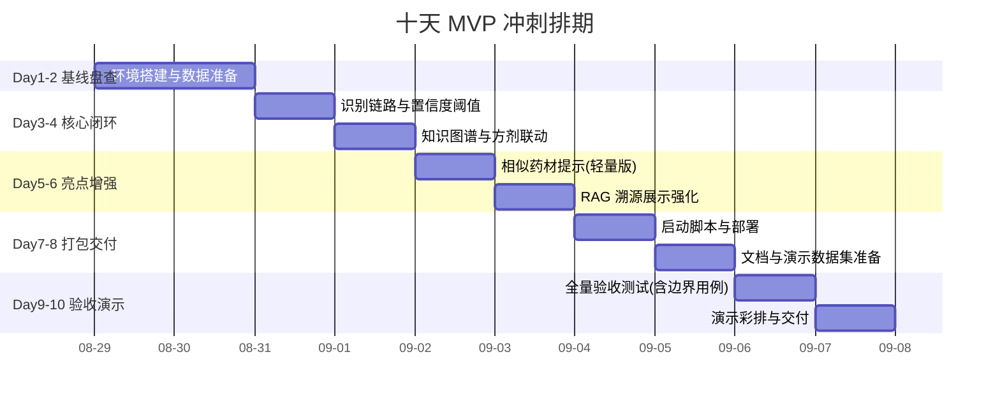

# herb_recognition 项目开发计划

> 项目：herb_recognition（中草药多模态识别系统）
> 版本：v1.0
> 日期：2026-08-28
> 计划周期：2026-08-29 至 2026-09-07（不足 10 天）
> 依据：需求文档 + 调研报告（docs/调研报告.md）

---

## 1. 项目概述

### 1.1 项目背景

中草药种类繁多，部分药材外观相似度高，普通人难以快速准确识别；同时药性、归经、配伍禁忌、方剂知识体量庞大且分散。现有工具"只识别不解析"或"只查询不收图"，无法完成"识别—解析—推荐"完整链路。本项目搭建中草药多模态识别系统，打通图像视觉与中医药知识库，构建"拍图→识别→解析→推荐→问答"一体化体验。

### 1.2 项目目标

1. 核心链路可跑通：拍图→识别→药性解析→方剂推荐→问答全流程演示可用；
2. 识别能力可达门槛：常见中草药识别准确率达到可用门槛（以官方评估实测为准），易混淆药材具备区分与置信度提示；
3. 安全有底线：医疗风险提示覆盖全部输出，毒性/禁忌药材强制警示；
4. 功能可交付：Web 演示端 + 核心服务接口无致命崩溃，无 API Key 时本地降级可用；
5. 亮点可展示：相似药材提示、问答溯源展示两项轻量增强。

### 1.3 项目范围

**范围内（In Scope，本期交付）**

| 模块 | 内容 |
|------|------|
| 识别引擎（A） | 图片识别候选排序、图文混合识别、置信度提示、相似药材提示 |
| 知识图谱（B） | 药材属性库 + 实体关系网络、方剂推荐与配伍风险标注 |
| 多模态交互（C） | 图转文本、文本提问、多轮问答、图文混合提问 |
| 结果展示（D） | 识别详情、药性分析、方剂展示、医疗风险提示、溯源展示 |
| 系统平台（E） | Web 演示端、核心服务接口、一键部署与文档 |

**范围外（Out of Scope，本期明确排除）**

| 事项 | 排除原因 | 说明 |
|------|---------|------|
| 移动端 / 微信小程序 | 涉及新前端工程，超出周期与人力 | 不承诺；后续可考虑 H5 包装现有 Web 端低成本触达 |
| 识别类别大规模扩展 | 受设备算力（显存/训练资源）与数据缺乏双重制约 | 不承诺；小样本扩展机制可作长期技术储备，待数据积累后评估 |
| 权威药典数据对接 | 依赖外部授权与版权处理 | 远期专项 |
| 开放知识图谱 API / B 端 | 需商业化与运营投入 | 平台化路线 |
| 用户反馈闭环与数据回流 | 需线上部署与埋点基础设施 | 上线后迭代 |

**安全红线**

- 定位为"科普辅助工具"，不提供诊断、处方建议；
- 所有识别输出附置信度提示，低置信度触发人工复核引导；
- 毒性/禁忌药材强制风险警示；
- 知识输出附来源标注（溯源）。

## 2. 技术方案概述

| 模块 | 技术要点 |
|------|---------|
| A 识别引擎 | 深度学习图像分类（类别规模待规划），图片 + 文本混合输入，置信度阈值与失败引导 |
| B 知识图谱 | 药材—性味归经—功效—病症—方剂—禁忌实体关系网络，含十八反/十九畏 |
| C 多模态交互 | 图转文本、文本提问、RAG 多轮对话（大模型 + 本地知识检索）、图文混合提问 |
| D 结果展示 | 识别详情 / 药性分析 / 方剂推荐联动，医疗风险提示，溯源与关注区域可视化 |
| E 系统平台 | Web 演示端（多页签）、REST 核心接口、无 Key 本地降级、一键启动脚本 |

## 3. 进度安排与工作量估计

### 3.1 十天冲刺排期（按天）

| 天 | 阶段 | 任务 | 交付物 / 验收 |
|:--:|------|------|--------------|
| D1-D2 | 基线盘查 | 环境搭建（算力/依赖/权重）；数据准备（图像数据集 + 知识图谱数据）；确认大模型 API Key 与本地权重路径；端到端跑通核心链路 | 环境检查报告；全链路截图存档 |
| D3-D4 | 核心闭环 | 识别链路 + 置信度阈值与低置信度引导；知识图谱属性/关系/方剂联动；医疗风险提示与毒性药材强提醒全覆盖 | 核心闭环可演示 |
| D5-D6 | 亮点增强 | 相似药材提示（输出外观差异与鉴别要点）；RAG 溯源来源展示强化 | 差异化功能演示通过 |
| D7-D8 | 打包交付 | 一键启动脚本；README 完善；准备演示数据集（易混淆药材、模糊图、毒药材等用例） | 新机器按文档 ≤30 分钟跑通 |
| D9 | 验收测试 | 全量回归 + 边界用例（模糊/低光/相似药材/无 Key 降级/防崩溃） | 验收报告，问题清零 |
| D10 | 演示交付 | 演示环境准备、演示脚本彩排、答辩材料 | 正式演示交付 |

### 3.2 工作量估计（人天）

| 模块 | 子模块 | 工作量估计（人天） | 说明 |
|------|--------|:---:|------|
| 1. 环境与数据（前置） | 1.1 环境搭建与依赖复现 | 1 | Day1 最高优先；算力/依赖/权重/API Key 确认 |
| | 1.2 数据准备（图像集 + 知识图谱数据） | 1 | 识别数据集与药性/方剂/配伍数据，关键前置 |
| 2. 识别引擎（A） | 2.1 图片识别 + 图文混合识别 + 置信度/失败引导 | 1 | 核心链路；低置信度引导人工复核 |
| | 2.2 相似药材提示（P1 增强） | 0.5 | 输出外观差异与鉴别要点 |
| 3. 知识图谱（B） | 3.1 药材属性库 + 实体关系网络 | 1 | 性味归经/功效/毒性/禁忌，含十八反/十九畏 |
| | 3.2 方剂推荐 + 配伍风险标注 | 0.5 | 识别后自动推荐并标注风险 |
| | 3.3 特性检索 + 图谱可视化 | 0.5 | 文本反查 + 关联关系展示 |
| 4. 多模态交互（C） | 4.1 图转文本 + 文本提问 + 多轮上下文 | 0.5 | 识别后自动出解析 |
| | 4.2 RAG 多轮对话 + 图文混合提问 | 0.5 | 大模型 + 本地知识检索 |
| 5. 结果展示（D） | 5.1 识别详情 / 药性分析 / 方剂展示联动 | 0.5 | |
| | 5.2 医疗风险提示全覆盖（含毒性强提醒） | 0.5 | 安全底线，100% 覆盖 |
| | 5.3 关注区域可视化 + RAG 溯源展示（P1 增强） | 0.5 | 可解释性 + 溯源 |
| 6. 系统平台（E） | 6.1 Web 演示端（多页签） | 0.5 | |
| | 6.2 核心服务接口 + 无 Key 本地降级 | 0.5 | 不报 500 |
| 7. 打包与验收 | 7.1 启动脚本 / README / 演示数据集 | 0.5 | 可复现，含易混淆/模糊/毒药材用例 |
| | 7.2 全量回归 + 边界用例 + 演示彩排 | 0.5 | 问题清零 |
| **总工作量（人天）** | | **10** | 与不足 10 天周期匹配（1-2 人） |

**工作量构成口径**：

| 工作类型 | 小计（人日） | 对应条目 |
|---------|:-----------:|---------|
| 环境与数据准备 | 2 | 1.1、1.2 |
| P0 核心功能（识别/图谱/交互/展示/平台） | 5 | 2.1、3.1、3.2、3.3、4.1、4.2、5.1、5.2、6.1、6.2 |
| P1 轻量增强 | 1.5 | 2.2、5.3 |
| 打包交付 | 0.5 | 7.1 |
| 验收测试与演示 | 0.5 | 7.2 |
| **合计** | **10** | 与周期匹配 |

> **缓冲管理**：10 天无天然缓冲。建议 Day 2 末、Day 5 末设两个检查点，若落后**立即砍 P1 范围**（2.2、5.3）而非挤压验收时间。

## 4. 风险评估和规避

### 4.1 技术风险

1. **数据准备不足**：图像数据集与知识图谱数据（药性/方剂/配伍）缺失或不完整，导致核心链路无法跑通。
   - 解决：Day1 优先盘点数据缺口；知识图谱数据按需求文档补齐；必要时先以样例集跑通演示，数据同步完善。

2. **算力不足**：无 GPU 或显存不足，模型训练/推理耗时影响排期。
   - 解决：Day1 确认本地硬件或云端资源；备选轻量模型 / CPU 推理兜底（慢但可演示）。

3. **识别准确率不达标**：相似药材混淆、模糊/低光图片误识。
   - 解决：预留模型微调时间；演示用例提前筛选高置信度案例；低置信度输出强制人工复核引导（安全兜底）。

4. **依赖与权重路径问题**：依赖版本不匹配、权重/模型路径不通用。
   - 解决：锁版本 + 一键环境脚本；路径自动探测/下载封装，避免手工配置。

### 4.2 管理风险

1. **范围蔓延**：团队中途想加新功能，挤压核心交付与验收时间。
   - 解决：严格执行范围边界（移动端、类别扩展、药典对接等明确排除）；Day2/Day5 设检查点，进度落后即砍 P1 增强（相似提示、溯源展示）而非挤压验收。

2. **人力与排期风险**：1-2 人并行任务多，10 天无天然缓冲。
   - 解决：按依赖关系串行排期（甘特图）；P0 核心优先、P1 增强置后；每日进度核对，D3 末须跑通核心链路。

3. **外部依赖管理**：大模型 API Key、权重文件未提前确认，临期才发现缺位。
   - 解决：Day1 集中确认并备案；系统设计内置本地检索降级逻辑，无 Key 也能完成演示，不阻塞验收。

### 4.3 其它风险

1. **演示翻车**：现场网络波动、预置图片不佳导致识别失败。
   - 解决：预置演示用例集（易混淆药材、模糊图、毒药材等边界用例）；准备失败兜底话术；演示环境离线可跑。

2. **知识准确性争议**：科普内容被误读为医疗建议，引发信任与合规风险。
   - 解决：所有输出附带医疗风险提示与免责声明（科普辅助、不替代诊断）；知识输出附来源标注；毒性/禁忌药材强制强提醒。

3. **数据来源合规**：药典、古籍等知识数据存在版权/授权约束。
   - 解决：本期仅采用自建整理与公开可用的资料数据；权威药典对接明确排除在本期范围之外，规避授权风险。

### 4.4 风险等级汇总

| 等级 | 风险项 | 应对要点 |
|:----:|--------|---------|
| **高（3 项）** | 数据准备不足、算力不足、范围蔓延 | Day1 优先处理；严格范围控制；检查点砍范围 |
| 中（6 项） | 识别准确率不达标、依赖/权重路径、人力排期、API Key 缺失、演示翻车、知识准确性争议 | 预案兜底（微调时间、锁版本、降级逻辑、演示用例集、免责声明） |
| 流程性约束（1 项） | 数据来源合规 | 仅用自建与公开数据，权威数据对接排除本期 |

## 5. 验收标准与交付物

**本期验收标准（全部必须达成）**：

| # | 验收项 | 标准 |
|---|--------|------|
| 1 | 环境可复现 | 新设备按文档 ≤30 分钟跑通全链路 |
| 2 | 识别能力 | 常见中草药识别准确率达到可用门槛（以官方评估实测为准）；演示用例全部正确 |
| 3 | 安全底线 | 风险提示覆盖 100% 输出；毒性/禁忌药材强制警示 |
| 4 | 功能完整 | 五大模块核心闭环可用，无致命崩溃 |
| 5 | 降级可用 | 未配置 API Key 时本地检索降级正常，不报 500 |

**交付物清单**：

| 序号 | 交付物 | 验收时间点 |
|:----:|--------|:----------:|
| 1 | 环境检查报告 | D2 |
| 2 | 核心闭环可演示版本 | D4 |
| 3 | 差异化功能演示（相似提示 + 溯源展示） | D6 |
| 4 | 一键启动脚本 + README + 演示数据集 | D8 |
| 5 | 验收报告（问题清零） | D9 |
| 6 | 演示脚本 + 答辩材料 | D10 |

---
