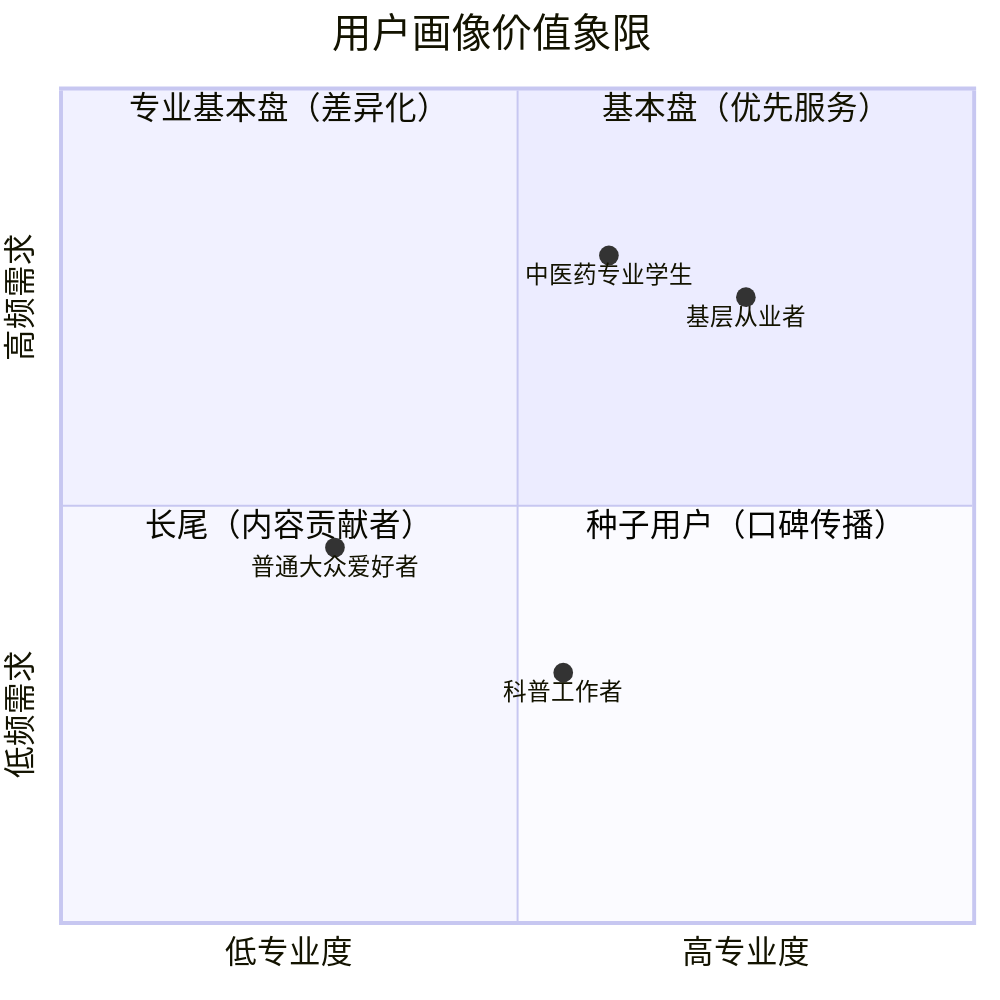
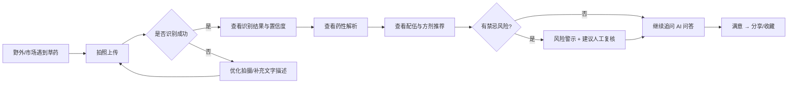
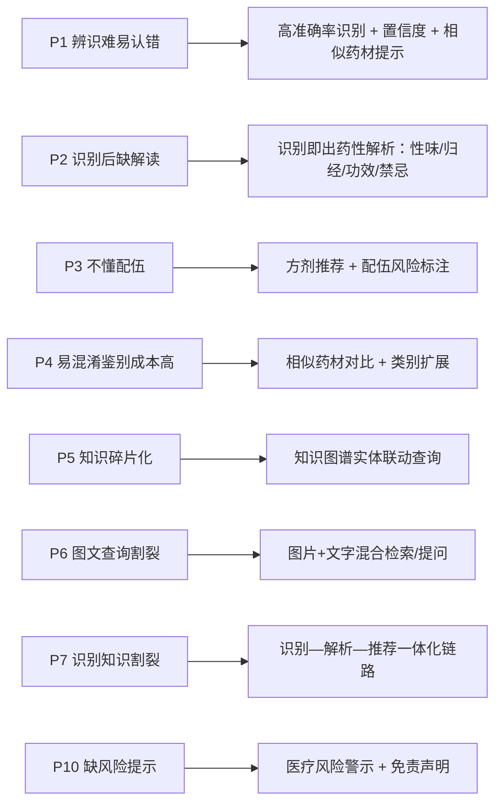
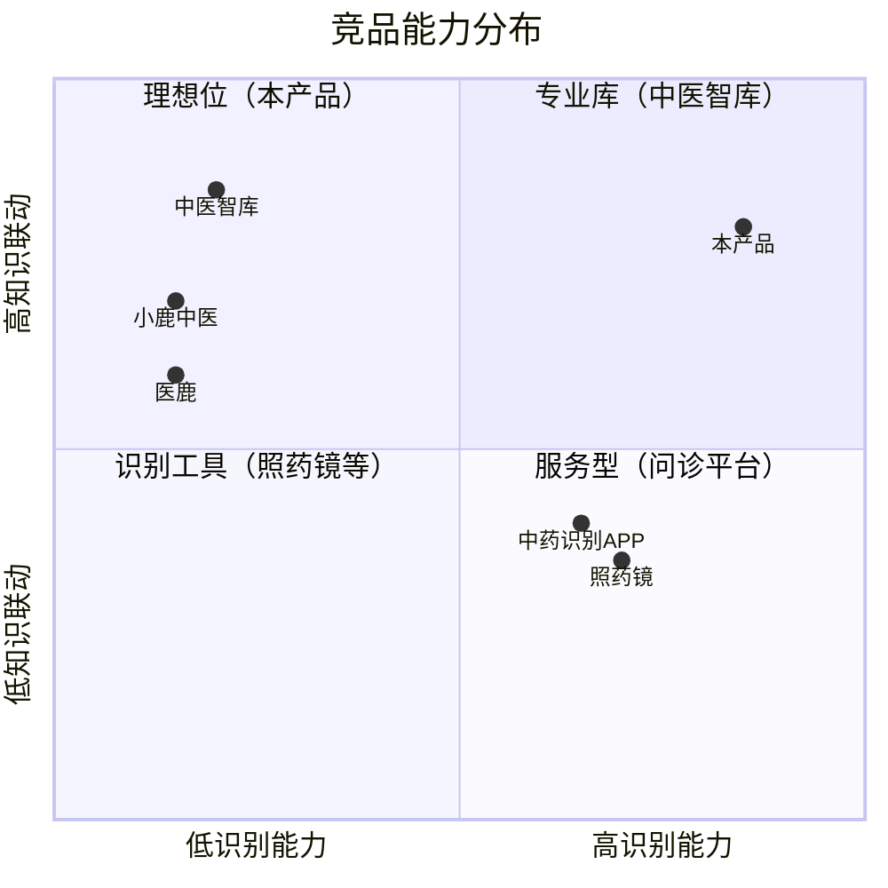
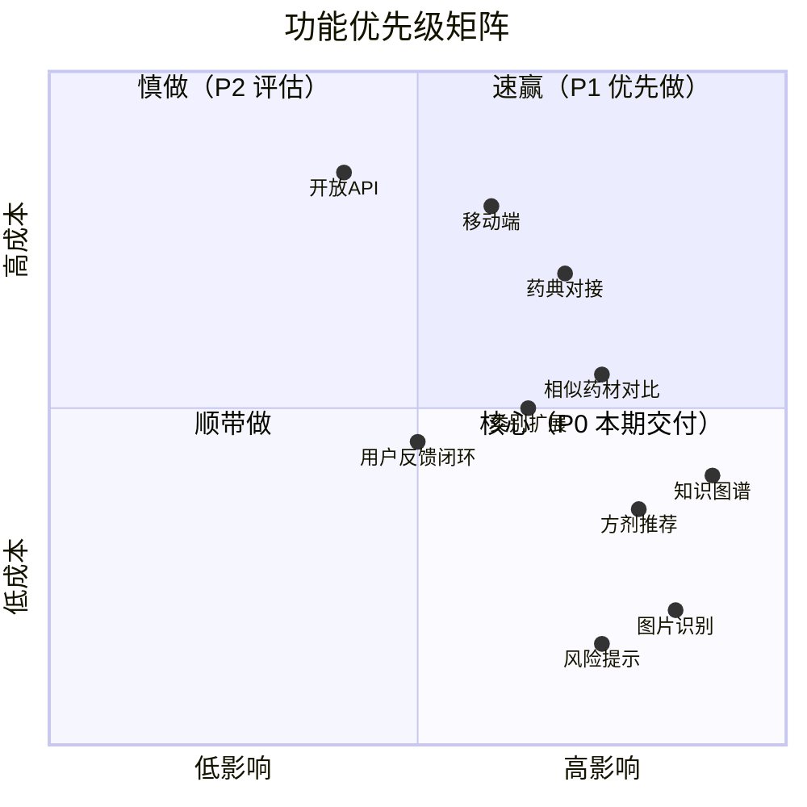
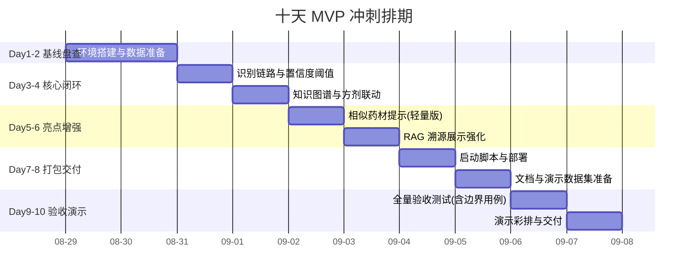
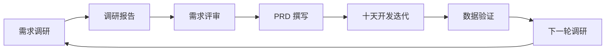

# 中草药多模态识别系统 需求调研报告

> 项目：herb_recognition（中草药多模态识别系统）
> 版本：v3.0（从 0 重写，基于需求文档 + 桌面调研）
> 日期：2026-08-28
> 定位：内部产品规划为主，同时结构清晰可对外展示/答辩

---

## 摘要（结论先行）

**核心结论：本项目"视觉识别 + 知识图谱 + 多模态问答"的产品定位精准切中市场空白，差异化明确。需求文档界定的功能范围清晰可控（识别—解析—推荐—问答闭环 + 安全底线），经可行性评估，在不足 10 天的工作周期内交付一个"可演示、可验证、可部署"的 MVP 可行；其中移动端、类别大规模扩展因周期不足、设备算力与数据缺乏双重制约，明确排除、不承诺；权威数据对接、开放平台等亦不纳入本期范围。**

| 调研结论 | 关键依据 |
|---------|---------|
| 市场存在明确需求缺口 | 现有中草药识别工具"只识别、不解析"，知识库平台"只查询、不收图"，无人打通"拍图→识别→解析→推荐"完整链路 |
| 竞品同质化严重，差异化空间大 | 竞品集中在"单点功能"：识别类不做知识联动，知识库类不支持图片输入，问诊类重服务轻科普 |
| 识别门槛有望达标 | 需求聚焦常见药材（类别规模待规划），深度学习图像分类技术路线业界成熟，对模糊/低质量图片的容错要求明确（需求文档 1.3），识别准确率有望达到可用门槛 |
| 核心壁垒是"知识图谱 + RAG"而非识别 | 识别是入口，知识联动与可解释性才是护城河 |
| 首要约束是安全合规 | 科普辅助工具定位，必须内置置信度提示与医疗风险警示（需求文档 1.5 硬约束） |
| 交付可行性 | 功能范围聚焦、外部依赖少，10 天内可交付 MVP；关键风险集中在识别准确率、数据准备与环境复现，均可控 |

---

## 1. 调研背景与目标

### 1.1 业务背景

中草药种类繁多，部分药材外观相似度高，传统人工辨认高度依赖从业者经验，普通使用者、基层人员很难快速准确识别药材；同时药材的药性、归经、配伍禁忌、方剂知识体量庞大，零散分布在古籍、药典资料中，查阅效率低。

现有识别工具大多只做单纯图片识别，缺少中医药知识联动，识别出药材后不能直接给出药性解读、配伍建议，无法完成"识别—解析—推荐"完整链路。因此本项目搭建**多模态中草药图像识别智能体**，打通图像视觉与中医药知识库，构建"拍图→识别→解析→推荐"一体化体验（需求文档 1.1）。

### 1.2 调研目标

1. 明确目标用户画像与核心痛点，验证需求真实性；
2. 完成中草药专用 App 与中医药知识库/问诊平台两类竞品的系统调研，识别市场空白；
3. 构建本产品 vs 竞品的功能矩阵，拆解产品功能矩阵并输出优先级排序；
4. 形成 **10 天内可落地的 MVP 交付计划**（排期到天），并明确本期范围边界与不承诺项（移动端、类别大规模扩展等受周期/设备/数据制约的项）。

### 1.3 调研范围界定

| 维度 | 界定 |
|------|------|
| 直接竞品 | 中草药专用 App（照药镜、中药识别、中药大全等） |
| 间接竞品 | 中医药知识库/问诊平台（中医智库、小鹿中医、医鹿、中医药信息网） |
| 行业背景（轻量提及） | 通用植物识别（形色、花伴侣）、通用 AI 助手（DeepSeek、通义千问等） |
| 不纳入 | 线下中药房、纸质药典等非数字产品 |

---

## 2. 调研方法说明

### 2.1 调研方法矩阵

| 方法 | 用途 | 产出 |
|------|------|------|
| 桌面研究（竞品公开资料、应用商店、官网） | 竞品功能、用户量、定价、评价 | 竞品底稿与对比表 |
| 需求文档梳理（本项目《需求文档.txt》） | 既有用户画像、痛点、功能需求与硬约束 | 用户画像、痛点与需求清单章节 |
| 数据分析（公开行业报告、市场数据） | 验证市场规模与需求真实性 | 优先级与路线图依据 |
| 用户反馈采样（公开评论、社区讨论） | 验证用户痛点的普遍性 | 痛点佐证 |

> 说明：本项目尚处规划阶段，暂未开展大规模问卷/访谈。**附录 7.2 已标注本报告的调研局限性与后续补充计划**，建议在本期交付后通过埋点 + 用户访谈补齐一手数据（见 6.6 闭环）。

### 2.2 调研对象与数据来源

- **中草药专用 App**：照药镜、中药识别 APP（广西慧意/深圳聚果）、中药大全、识药材等，来源为应用商店介绍、百度百科、官方报道；
- **中医药知识库/问诊平台**：中医智库（神黄科技）、小鹿中医、医鹿（阿里健康）、中医药信息网（tcmtt.cn）等；
- **行业背景**：形色（4000 种植物、日均 35 万张图片处理量、宣称准确率 98%）、花伴侣（依托中科院植物所）等。

### 2.3 调研时间与覆盖

- 调研时间：2026-08；
- 覆盖竞品 8 款，功能维度 20+ 项，形成"竞品功能对比总表"（见 4.5）。

---

## 3. 用户画像分析

### 3.1 核心结论

**目标用户可划分为 4 类画像，其中"普通大众爱好者"（识别诉求为主）与"中医药专业学生/基层从业者"（解析诉求为主）构成基本盘；两类人群对"识别 + 知识联动"均有强需求，但对内容的专业深度与安全提示要求不同，产品需分层设计。**

### 3.2 四类用户画像

| 维度 | 画像1：普通大众爱好者 | 画像2：中医药专业学生 | 画像3：基层中医药从业者 | 画像4：中医药科普工作者 |
|------|----------------------|----------------------|------------------------|------------------------|
| 年龄/身份 | 25-55 岁，养生/户外/采药爱好者 | 中医药大学本科生、研究生 | 基层诊所药师、乡村中医、药材收购人员 | 科普博主、文化馆工作人员 |
| 专业水平 | 无系统中医药知识 | 有基础，正在系统学习 | 有基础，专家经验有限 | 有一定知识，侧重传播 |
| 核心诉求 | 拍照快速识别 + 通俗解读 + 风险提醒 | 辅助鉴别易混淆药材 + 知识联动检索 | 辅助鉴别真伪 + 快速查配伍禁忌 | 快速获取图文资料做科普素材 |
| 典型场景 | 野外识别、辨认家中药材、养生查询 | 野外实训、课后复习、课程作业 | 药材初筛鉴别、配伍参考 | 科普文案、课件素材整理 |
| 使用频率 | 偶发 | 高频、学习期集中 | 高频、工作场景 | 中频、按需 |
| 对识别的需求 | 快速、简单、容错 | 高准确率、能区分相似药材 | 高准确率 + 置信度提示 | 附带权威信息可引用 |
| 对解析的需求 | 通俗、简短、有禁忌提醒 | 完整、权威、关联方剂 | 权威、全面、可复核 | 图文一体、便于引用 |
| 付费意愿 | 低（免费科普） | 低-中 | 中（效率工具） | 中（内容生产） |

### 3.3 用户旅程地图（以普通用户为例）

**旅程关键痛点标注**：

| 阶段 | 用户行为 | 当前痛点 | 产品机会 |
|------|---------|---------|---------|
| 拍摄 | 拍照上传 | 相似药材肉眼难辨，怕认错 | 置信度提示 + 相似药材对比 |
| 识别 | 等待结果 | 识别后只拿到名字，无解读 | 候选排序 + 药性/方剂联动输出 |
| 解析 | 查看药性 | 需多处翻阅，信息零散 | 知识图谱一键聚合性味/归经/功效/禁忌 |
| 推荐 | 看方剂 | 不懂配伍，怕用错 | 方剂推荐 + 配伍风险标注（十八反/十九畏） |
| 追问 | AI 问答 | 通用 AI 无专业依据，易幻觉 | RAG 检索 + 知识库依据来源标注 |

### 3.4 痛点分析

#### 3.4.1 普通大众用户痛点

| # | 痛点 | 具体表现 | 佐证 |
|---|------|---------|------|
| P1 | 药材辨识难，肉眼易认错 | 相似品种多，误认存在误食中毒风险；网上文字对比效率低、易误判 | 需求文档 2.1-1；同类产品评论区常见"怕认错中毒"反馈 |
| P2 | 识别后缺少配套知识解读 | 只输出名字，查不到完整药性、禁忌、适用情况 | 需求文档 2.1-2 |
| P3 | 不懂配伍，不会参考方剂 | 不知适合病症、与哪些药材搭配、哪些不能混用 | 需求文档 2.1-3 |

#### 3.4.2 中医药学生、基层从业者痛点

| # | 痛点 | 具体表现 | 佐证 |
|---|------|---------|------|
| P4 | 易混淆药材鉴别成本高 | 大量外观近似饮片/原药材，鉴别依赖经验，新人上手慢 | 需求文档 2.2-1 |
| P5 | 中医药知识碎片化，检索繁琐 | 药典、古籍、方剂分散，串联实体关系效率低 | 需求文档 2.2-2 |
| P6 | 缺少图文一体化查询手段 | 知识库只支持文字检索，只有实物照片就查不了 | 需求文档 2.2-3 |

#### 3.4.3 行业层面痛点（竞品共同短板）

| # | 痛点 | 表现 | 竞品佐证 |
|---|------|------|---------|
| P7 | 识别与知识割裂 | 市面识别工具只做图像分类，无知识联动 | 照药镜/中药识别等聚焦"识别+条目查询"，未打通推理 |
| P8 | 知识库不支持图片输入 | 必须先知药材名才能查询 | 中医智库、中医药信息网均为纯文本检索 |
| P9 | 缺少多模态混合交互 | 无法"拍照片 + 文字提问"混合问答 | 全市场未见同类能力 |
| P10 | 缺乏风险与置信度提示 | 易误识 + 误用药风险，多数工具无提示 | 竞品普遍无置信度/风险警示模块 |

#### 3.4.4 共性风险痛点

误识带来安全隐患：相似药材极易混淆，错误识别 + 错误用药会造成健康风险。**这是本产品的第一约束，所有输出必须附带置信度与风险警示，并明确"科普辅助、不替代诊断"（需求文档 1.5）。**

### 3.5 痛点 → 需求映射

---

## 4. 竞品分析

### 4.1 核心结论

**两类竞品均为"单点能力"产品：中草药识别 App 强在识别与条目展示，弱在知识推理与多模态交互；知识库/问诊平台强在数据全与专业服务，弱在图片入口与大众科普。本项目"识别 + 图谱 + RAG 问答"的组合在当前市场无直接对标产品，差异化显著，但需以"知识准确性 + 安全边界"建立信任壁垒。**

### 4.2 竞品选择逻辑

| 类别 | 产品 | 与本产品关系 |
|------|------|-------------|
| 中草药专用 App | 照药镜、中药识别 APP、中药大全、识药材 | **直接竞品**（用户确认纳入） |
| 中医药知识库/问诊平台 | 中医智库、小鹿中医、医鹿、中医药信息网 | **直接竞品**（用户确认纳入） |
| 通用植物识别 | 形色、花伴侣 | 间接竞品（可替代部分识别场景） |
| 通用 AI 助手 | DeepSeek、通义千问、ChatGPT | 间接竞品（可替代部分问答场景） |

### 4.3 中草药专用 App 类竞品详析

| 产品 | 背景/规模 | 核心功能 | 优势 | 短板 |
|------|----------|---------|------|------|
| **照药镜** | 成都市药品检验研究院官方出品，免费 | 拍照/语音识别药材，输出名称、性状、功能主治、性味归经；3D 药材、正品/非正品对照、原植物浏览；毒性药材标注 | 官方背书、数据权威、免费、正品对照有特色 | 以"查"为主无智能解析；无配伍/方剂推荐；无多轮问答 |
| **中药识别 APP**（广西慧意/深圳聚果） | 商业 App，更新频繁 | 拍照识别 + 别名/性味/功效；中药百科（按人体部位分类）；历代方剂收录（来源、服用方法） | 功能全面、方剂库成体系 | 识别与知识两张皮，无跨实体推理；权威性一般 |
| **中药大全** | 图谱查询类 | 按药名/部位查询药材信息 | 查询方便 | 无图像识别；纯静态条目 |
| **识药材/识万物扫一扫** | 通用识别类 | 拍照识别草药，给出基本详情与相似对比 | 识别入口简单 | 知识深度浅；无专业联动 |

### 4.4 中医药知识库/问诊平台类竞品详析

| 产品 | 背景/规模 | 核心功能 | 优势 | 短板 |
|------|----------|---------|------|------|
| **中医智库**（神黄科技） | 大数据平台 + App，覆盖古籍/医案/方剂/本草/经穴/名医/百科七大模块 | 全文检索古籍、医案、方剂、经穴等 | 数据海量、专业权威、检索强 | 纯文本、无图片入口；面向学习研究，非大众科普；无识别能力 |
| **小鹿中医** | 互联网中医问诊平台（医生版+患者版） | 在线问诊、复诊、开方 | 真人医生服务、业务闭环 | 重服务、无科普工具属性；识别与知识联动弱 |
| **医鹿**（阿里健康） | 阿里健康旗下互联网医疗 | 在线问诊、义诊、健康管理 | 生态流量大、医疗资源丰富 | 综合医疗定位，中医药非核心；无草药识别 |
| **中医药信息网**（tcmtt.cn） | 科研数据库 | 中药材、有效成分、靶基因、疾病等数据浏览/搜索/下载 | 科研数据专业、结构化 | 科研向、门槛高；无图像识别；无大众交互 |

### 4.5 竞品功能对比总表

| 功能维度 | 照药镜 | 中药识别APP | 中药大全 | 中医智库 | 小鹿中医 | 医鹿 | 中医药信息网 | **本产品** |
|---------|:-----:|:-----:|:-----:|:-----:|:-----:|:-----:|:-----:|:-----:|
| 拍照识别药材 | ✅ | ✅ | ❌ | ❌ | ❌ | ❌ | ❌ | ✅ |
| 图片+文字混合输入 | ❌ | ❌ | ❌ | ❌ | ❌ | ❌ | ❌ | ✅ |
| 识别置信度提示 | ⚠️部分 | ❌ | ❌ | ❌ | ❌ | ❌ | ❌ | ✅ |
| 药性解析（性味归经功效） | ✅ | ✅ | ✅ | ✅ | ⚠️间接 | ❌ | ✅ | ✅ |
| 知识图谱实体联动 | ❌ | ❌ | ❌ | ⚠️检索联动 | ❌ | ❌ | ⚠️结构化 | ✅ |
| 配伍禁忌（十八反/十九畏） | ⚠️毒性标注 | ⚠️部分 | ⚠️部分 | ✅古籍 | ✅医嘱 | ❌ | ❌ | ✅ |
| 方剂推荐 | ❌ | ✅收录 | ✅收录 | ✅检索 | ✅开方 | ❌ | ❌ | ✅ |
| 相似药材对比 | ⚠️正品对照 | ❌ | ❌ | ❌ | ❌ | ❌ | ❌ | ✅（本期轻量版） |
| 多轮 AI 问答 | ❌ | ❌ | ❌ | ❌ | ✅医生 | ✅医生 | ❌ | ✅ |
| 问答知识库依据标注 | ❌ | ❌ | ❌ | ❌ | ⚠️医生回答 | ❌ | ❌ | ✅（RAG 溯源） |
| 识别可解释性（关注区域） | ❌ | ❌ | ❌ | ❌ | ❌ | ❌ | ❌ | ✅ |
| 图谱可视化 | ❌ | ❌ | ❌ | ⚠️关系展示 | ❌ | ❌ | ❌ | ✅ |
| 医疗风险提示 | ⚠️毒性标注 | ❌ | ❌ | ❌ | ✅合规 | ✅合规 | ❌ | ✅ |
| 网页/接口开放 | ❌ | ❌ | ❌ | ✅ | ❌ | ✅ | ✅ | ✅ |

> 结论：**"多模态混合输入 + 知识图谱推理 + RAG 溯源问答 + 可解释性"四项组合能力，竞品矩阵中无任何一款具备，是本产品最核心的差异化。**

### 4.6 竞品差距与机会点（SWOT）

| 维度 | 结论 |
|------|------|
| **优势（S）** | 差异化定位（识别+图谱+RAG+可解释）；十八反/十九畏等安全数据计划纳入知识库（待实现）；目标轻量可部署、可复现；知识联动防幻觉 |
| **劣势（W）** | 药材类别覆盖有限（规模待规划，受设备算力与数据缺乏制约，短期难以扩展）；无移动端（本期周期不足）；识别依赖图片质量；未接入权威药典实时数据 |
| **机会（O）** | 竞品均无"识别+推理"一体化；中医药科普政策利好；AIGC 让大众更易接受 AI 问答；可向院校/基层医疗做 B 端延伸 |
| **威胁（T）** | 通用 AI 助手（可拍照）能力快速逼近；大厂（阿里、百度）若入场中医垂直场景资源碾压；知识准确性争议引发信任危机 |

---

## 5. 功能矩阵与需求清单

### 5.1 核心结论

**本产品功能矩阵可拆解为"识别、知识、交互、展示、系统"五大模块共 17 项功能（源自需求文档 1.2/1.3），按优先级划分为：P0 级 8 项（本期必须交付的核心闭环）、P1 级 2 项（本期轻量增强）、P2 级 7 项（远期愿景或受资源制约不承诺）。优先级遵循"识别为入口、知识为壁垒、安全为底线、体验为放大器"的排序逻辑。**

### 5.2 本产品 vs 竞品功能矩阵对比

| 功能 | 本产品（规划） | 竞品平均水平 | 差异化评级 |
|------|:------:|:-----------:|:---------:|
| 拍照识别 | P0 本期交付 | ✅ 普遍具备 | 持平 |
| 相似药材区分（候选排序 + 置信度） | P0 本期交付 | ⚠️ 仅部分 | **领先** |
| 文本特性检索 | P0 本期交付 | ⚠️ 部分 | 领先 |
| 药性解析自动输出 | P0 本期交付 | ⚠️ 需手动查 | **领先** |
| 知识图谱实体联动 | P0 本期交付 | ❌ 缺失 | **独占** |
| 方剂推荐 | P0 本期交付 | ⚠️ 静态收录 | **领先** |
| 配伍禁忌（18反/19畏） | P0 本期交付 | ⚠️ 部分 | **领先** |
| 图谱可视化 | P0 本期交付 | ⚠️ 静态展示 | 领先 |
| AI 多轮问答 | P0 本期交付 | ⚠️ 通用型 | **领先** |
| RAG 溯源标注 | P1 本期增强 | ❌ 缺失 | **独占** |
| 识别可解释性（关注区域） | P1 本期增强 | ❌ 缺失 | **独占** |
| 风险提示 | P0 本期交付 | ⚠️ 部分 | 领先 |
| Web 演示 + REST API | P0 本期交付 | ⚠️ 部分 | 领先 |
| 相似药材对比详解 | P1 本期增强 | ⚠️ 仅正品对照 | 领先 |
| 移动端 | ❌ 不承诺（周期不足，排除本期） | ✅ 普遍 | **落后** |
| 类别扩展（扩充类别规模） | ❌ 不承诺（设备/数据制约） | ✅ 覆盖面广 | 落后 |
| 权威数据对接（药典） | P2 远期（不纳入本期） | ✅ 部分 | 落后 |

### 5.3 功能矩阵分解

#### 模块 A：识别引擎（入口）

| 编号 | 功能 | 优先级 | 说明 |
|------|------|:------:|------|
| A1 | 药材图片分类识别 | P0 | 输出候选排序与置信度，覆盖常见药材（类别规模待规划） |
| A2 | 图片+文本混合识别 | P0 | 文字描述辅助图片识别，提升易混淆药材区分度 |
| A3 | 识别置信度提示 | P0 | 低置信度提醒人工复核（安全底线） |
| A4 | 相似药材提示（轻量版） | P1 | 基于识别结果输出外观差异与鉴别要点 |

#### 模块 B：中医药知识图谱（壁垒）

| 编号 | 功能 | 优先级 | 说明 |
|------|------|:------:|------|
| B1 | 药材属性库（性味/归经/功效/毒性） | P0 | 别名、性味归经、功效、毒性、禁忌（需求文档 1.2） |
| B2 | 实体关系网络（药-效-病-方-忌） | P0 | 含十八反/十九畏配伍禁忌 |
| B3 | 方剂库与推荐 | P0 | 经典方剂组成、主治、配伍关系，识别后自动推荐 + 风险标注 |
| B4 | 特性检索（按性味/功效反查） | P0 | 文本→药材→方剂 |
| B5 | 图谱可视化交互 | P0 | 药材-方剂-病症关联关系可视化 |
| B6 | 权威数据源对接（药典） | P2 远期 | 依赖外部授权与版权处理，不纳入本期 |

#### 模块 C：多模态交互（体验）

| 编号 | 功能 | 优先级 | 说明 |
|------|------|:------:|------|
| C1 | 图转文本（拍图→自动解析） | P0 | 识别后自动调知识图谱输出药性分析 |
| C2 | 文本提问 | P0 | 特性检索 + 图谱问答，如"不能和什么搭配" |
| C3 | 多轮 AI 对话（RAG） | P0 | 大模型 + 本地知识检索 + 溯源 |
| C4 | 图文混合提问 | P0 | 图片 + 文字问题同时输入 |
| C5 | 多模态 Agent 工具调用 | P2 远期 | 编排识别/检索/问答，不纳入本期 |
| C6 | 多轮追问上下文 | P0 | 对话历史保持 |

#### 模块 D：结果展示（信任）

| 编号 | 功能 | 优先级 | 说明 |
|------|------|:------:|------|
| D1 | 识别候选结果 + 置信度 | P0 | |
| D2 | 药性分析（性味/功效/适用/禁忌） | P0 | |
| D3 | 方剂推荐 + 配伍风险提示 | P0 | 十八反/十九畏红色/橙色标注 |
| D4 | 识别关注区域可视化 | P1 | 可解释性，建立信任 |
| D5 | RAG 知识库依据标注 | P1 | 减少幻觉 |
| D6 | 医疗风险提示 | P0 | 科普定位合规底线（需求文档 1.5） |

#### 模块 E：系统与平台（底座）

| 编号 | 功能 | 优先级 | 说明 |
|------|------|:------:|------|
| E1 | Web 演示端 | P0 | 五大功能页签 |
| E2 | REST 服务接口 | P0 | 识别/解析/问答等核心接口 |
| E3 | 类别扩展机制（小样本） | P2 不承诺 | 受设备算力与数据缺乏制约，难以实现；机制可作长期技术储备 |
| E4 | 移动端 / 小程序 | P2 不承诺 | 周期与人力不足，排除本期；后续可考虑 H5 包装现有 Web 端低成本触达 |
| E5 | 用户反馈与数据回流 | P2 远期 | 需线上部署与埋点基础设施 |

### 5.4 需求清单与优先级排序

**优先级定义**：

- **P0（本期必须交付）**：核心闭环功能与安全底线，缺失则演示不可用或违反安全约束；
- **P1（本期轻量增强）**：低成本增强，显著提升演示说服力；
- **P2（远期/不承诺）**：依赖外部数据授权/新平台工程/资源制约，本期不可行。

| 优先级 | 编号 | 需求 | 关联痛点 | 对应模块 | 本期动作 |
|:------:|------|------|---------|---------|---------|
| P0 | A1 | 药材图片识别（候选排序） | P1 | A | 交付 + 回归验证 |
| P0 | A2 | 图片+文本混合识别 | P1/P6 | A | 交付 + 回归验证 |
| P0 | A3 | 识别置信度提示 | P1/P10 | A | 阈值调优 + 失败引导 |
| P0 | B1/B2 | 知识图谱（属性+关系） | P5 | B | 数据质量校验 |
| P0 | B3 | 方剂推荐 + 配伍风险 | P3/P4 | B | 演示用例验证 |
| P0 | D6 | 医疗风险提示（安全底线） | P10 | D | 全覆盖核查（含毒性药材） |
| P0 | C1/C2 | 图转文本 + 文本提问 | P2/P6 | C | 交互打磨 |
| P0 | E1/E2 | Web 演示 + REST 接口 | — | E | 稳定性 + 降级验证 |
| P1 | A4 | 相似药材提示（轻量版） | P1/P4 | A | 基于识别结果快速实现 |
| P1 | D5 | RAG 溯源展示强化 | P5 | D | 强化知识库来源展示 |
| P2 | B6 | 权威数据源对接（药典） | P5 | B | 远期，不纳入本期 |
| P2 | E3 | 类别扩展（扩充类别规模） | P4 | E | 受设备算力与数据缺乏双重制约，难以实现，不承诺 |
| P2 | E4 | 移动端 / 微信小程序 | 触达 | E | 周期不足，不承诺 |
| P2 | C5 | 多模态 Agent 工具调用 | — | C | 远期，不纳入本期 |
| P2 | E5 | 用户反馈闭环 + 数据回流 | — | E | 远期，需线上部署 |
| P2 | A5 | 识别链路云端化（轻模型上云） | — | A | 远期，不纳入本期 |
| P2 | B7 | 开放知识图谱 API（B 端） | — | B | 远期，不纳入本期 |

### 5.5 需求优先级汇总

| 优先级 | 数量 | 核心特征 | 本期动作 |
|:------:|:----:|---------|---------|
| P0 | 8 | 识别—解析—问答闭环 + 安全底线 | 交付、打磨、全量验证 |
| P1 | 2 | 相似药材提示、RAG 溯源展示（轻量增强） | 低风险交付 |
| P2 | 7 | 权威数据/开放平台/云端化/Agent/反馈闭环（远期）；移动端、类别扩展（资源制约，不承诺） | **移出本期，不作交付承诺** |

---

## 6. 需求落地建议（十天 MVP 冲刺计划）

### 6.1 核心结论（可行性判断）

**结论：在不足 10 天的工作周期内交付一个"可演示、可验证、可部署"的完整 MVP，可行。** 依据：需求文档界定的功能范围聚焦（识别—解析—推荐—问答闭环 + 安全底线），核心链路单一、外部平台依赖少，10 天内可完成核心功能落地与验证。**但可行性成立的前提是严格范围控制**——本期只做核心闭环的交付与打磨，不做任何新平台 / 新数据规模类功能；移动端、类别大规模扩展明确排除。

### 6.2 可行性分析

#### 6.2.1 资源与复杂度评估

| 维度 | 评估 | 十天可行性结论 |
|------|------|--------------|
| 功能范围 | 五大模块 17 项，P0 核心闭环 8 项（需求文档 1.2/1.3） | ✅ 范围可控，重心在核心链路 |
| 识别门槛 | 常见药材（类别规模待规划）+ 高准确率 + 低质图容错要求（需求文档 1.3） | ✅ 技术路线成熟，有望达标 |
| 算力 | 深度学习训练/推理，需 GPU 或云算力 | ⚠️ 需提前确认硬件或云端资源 |
| 数据 | 需药材图像数据集 + 知识图谱数据（药性/方剂/配伍） | ⚠️ 数据准备是关键前置，需尽早确认 |
| 外部依赖 | 大模型 API（可选）、本地知识检索 | ⚠️ 需提前确认 Key 与权重路径 |
| 人力 | 默认 1-2 人 | ⚠️ 仅支持"交付+打磨"型工作，不支持并行大功能开发 |

#### 6.2.2 工作量估算

| 工作类型 | 估算（人日） | 说明 |
|---------|:-----------:|------|
| 环境搭建与数据准备 | 2 | 最高优先，先跑通再谈其他 |
| P0 交付打磨（置信度/失败引导/风险提示） | 2 | 交互与安全底线 |
| P1 轻量增强（相似提示/溯源展示） | 2 | 差异化亮点，低风险 |
| 打包与交付物（脚本/文档） | 2 | 演示环境与可复现性 |
| 验收测试与演示准备 | 2 | 边界用例 + 演示脚本 |
| **合计** | **10** | 与周期匹配，无冗余缓冲，需严格按排期执行 |

> 详细模块/子模块工作量分解见 `docs/项目开发计划.md`（3.2 节）。
> **缓冲管理**：10 天无天然缓冲。建议 Day 2 末、Day 5 末设两个检查点，若落后**立即砍 P1 范围**而非挤压验收时间。

### 6.3 范围控制（做 / 不做清单）

**本期做（In Scope）**：

| 序号 | 事项 | 产出 |
|------|------|------|
| 1 | 环境搭建与端到端基线验证 | 环境检查报告 + 全链路跑通 |
| 2 | P0 体验打磨：置信度阈值、识别失败引导、风险提示全覆盖 | 交互优化版 |
| 3 | P1 轻量增强：相似药材提示、RAG 溯源展示强化 | 差异化亮点 |
| 4 | 打包交付：启动脚本 / README / 演示数据集 | 一键可复现部署包 |
| 5 | 验收测试 + 演示准备 | 验收报告 + 演示脚本 |

**本期不做（Out of Scope，明确排除）**：

| 事项 | 排除原因 | 说明 |
|------|---------|------|
| 移动端 / 小程序 | 涉及新前端工程，超出本项目周期与人力 | 不承诺；后续可考虑 H5 包装现有 Web 端低成本触达 |
| 类别扩展（扩充类别规模） | 受设备算力（显存/训练资源）与数据缺乏双重制约，短期难以实现 | 不承诺；小样本扩展机制可作长期技术储备，待数据积累后再评估 |
| 权威药典数据对接 | 依赖外部授权与版权处理 | 远期专项 |
| 开放知识图谱 API / B 端 | 需商业化与运营投入 | 平台化路线 |
| 用户反馈与数据闭环 | 需线上部署与埋点基础设施 | 上线后迭代 |

### 6.4 十天冲刺排期（按天）

| 天 | 阶段 | 任务 | 交付物 / 验收 |
|:--:|------|------|--------------|
| D1-D2 | 基线盘查 | 环境搭建（算力/依赖/权重）；数据准备（图像数据集 + 知识图谱 CSV）；确认大模型 API Key 与本地权重路径；端到端跑通核心链路 | 环境检查报告；全链路截图存档 |
| D3-D4 | 核心闭环 | 识别链路 + 置信度阈值与低置信度引导；知识图谱属性/关系/方剂联动；医疗风险提示与毒性药材强提醒全覆盖 | 核心闭环可演示 |
| D5-D6 | 亮点增强 | 相似药材提示（输出外观差异与鉴别要点）；RAG 溯源来源展示强化 | 差异化功能演示通过 |
| D7-D8 | 打包交付 | 一键启动脚本；README 完善；准备演示数据集（易混淆药材、模糊图、毒药材等用例） | 新机器按文档 ≤30 分钟跑通 |
| D9 | 验收测试 | 全量回归 + 边界用例（模糊/低光/相似药材/无 Key 降级/防崩溃） | 验收报告，问题清零 |
| D10 | 演示交付 | 演示环境准备、演示脚本彩排、答辩材料 | 正式演示交付 |

### 6.5 验收标准与风险应对

**本期验收标准（全部必须达成）**：

| # | 验收项 | 标准 |
|---|--------|------|
| 1 | 环境可复现 | 新设备按文档 ≤30 分钟跑通全链路 |
| 2 | 识别能力 | 常见中草药识别准确率达到可用门槛（以官方评估实测为准）；演示用例全部正确 |
| 3 | 安全底线 | 风险提示覆盖 100% 输出；毒性/禁忌药材强制警示 |
| 4 | 功能完整 | 五大模块核心闭环可用，无致命崩溃 |
| 5 | 降级可用 | 未配置 API Key 时本地检索降级正常，不报 500 |

**风险与应对（十天版）**：

| 风险 | 等级 | 触发点 | 应对 |
|------|:----:|--------|------|
| 数据准备不足 | **高** | 图像数据集与知识图谱数据缺失或不完整 | Day1 优先盘点；知识图谱数据按需求文档 1.2 补齐；必要时先以样例集演示 |
| 算力不足 | 高 | 无 GPU 或显存不足，训练/推理慢 | 提前确认硬件或云端资源；备选小模型 / CPU 推理（慢但可演示） |
| 识别准确率不达标 | 中 | 相似药材混淆、低质图误识 | 预留模型微调时间；演示用例提前筛选取胜 |
| API Key 缺失 | 中 | 未配置大模型 API Key | 系统设计内置本地降级逻辑（待实现），演示以本地结果为主 |
| 权重/依赖路径问题 | 中 | 路径不通用、依赖版本不匹配 | 封装自动探测 / 锁版本方案 |
| 演示翻车 | 中 | 现场图片不佳 | 预置演示用例集 + 失败兜底话术 |
| 范围蔓延 | **高** | 团队想做新功能 | 严格执行 6.3 边界；Day2/Day5 检查点砍范围 |

### 6.6 从调研到落地的闭环

> 本期交付后，通过埋点 + 用户访谈补齐一手调研数据（真实用户量、识别失败样本、高频药材分布、纠错反馈），驱动下一轮需求调研，形成"调研—落地—验证—再调研"循环，并为后续规划提供决策依据：开放平台等远期愿景按序推进；移动端、类别扩展视资源与数据积累条件再评估。

---

## 7. 附录

### 7.1 需求文档关键引用

- 用户画像 4 类（普通大众爱好者 / 中医药专业学生 / 基层中医药从业者 / 中医药科普工作者）——详见正文 3.2；
- 痛点 P1-P10——详见正文 3.4；
- 功能需求五大类（识别 / 知识图谱 / 多模态交互 / 结果展示 / 非功能性）——需求文档 1.2-1.3，详见正文 5.3；
- 项目硬约束："本系统属于科普辅助工具，不能替代医师诊断，不能直接用于开药治病，输出结果必须附带医疗风险提示。"——对应 P0 需求 D6（需求文档 1.5）。

### 7.2 调研局限性说明

| 局限 | 说明 | 补充计划 |
|------|------|---------|
| 未开展问卷/访谈 | 用户画像与痛点主要来自需求文档与公开资料 | 本期交付后开展用户访谈 + 问卷 |
| 竞品数据基于公开信息 | 部分竞品内测功能无法核实 | 定期复查，建立竞品监控 |
| 识别类别覆盖面窄 | 常见药材类别规模 vs 药材总数差距明显；受设备算力与数据缺乏制约，短期难以扩展 | 小样本扩展机制可作技术储备（E3），待数据积累后评估，不承诺时间 |
| 无真实用户行为数据 | 优先级为专家判断 | 埋点数据回流后修正 |

### 7.3 需求清单速查表

| 优先级 | 需求项 |
|:------:|--------|
| P0（本期交付） | A1 图片识别、A2 混合识别、A3 置信度、B1/B2 知识图谱、B3 方剂推荐、C1/C2 图转文本+文本提问、D6 风险提示、E1/E2 Web+接口 |
| P1（本期增强） | A4 相似药材提示（轻量版）、D5 RAG 溯源展示强化 |
| P2（远期/不承诺） | 远期：A5 识别云端化、B6 权威数据对接、B7 开放图谱 API、C5 多模态 Agent、E5 反馈闭环；不承诺：E3 类别扩展、E4 移动端（受周期/设备/数据制约） |

---
