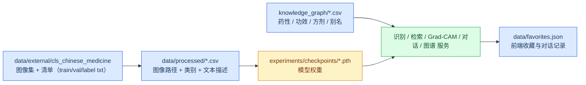
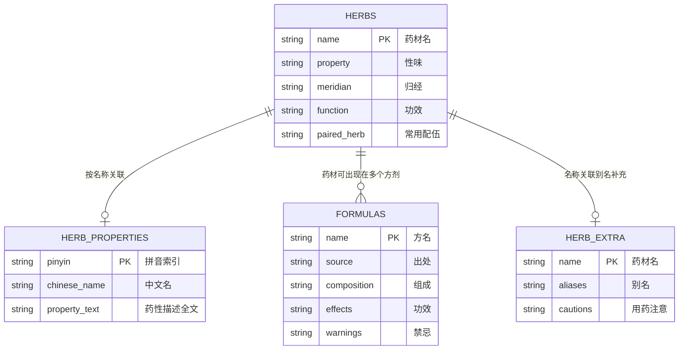

# 数据说明文档

> 项目：herb_recognition（本草掠影）
> 版本：v1.0
> 日期：2026-09-02
> 说明：本系统不依赖传统数据库，全部知识以 **CSV / JSON 结构化文件** 与 **PyTorch 权重文件** 形式组织。本文档即对应提交材料「数据库」交付物，逐一说明各数据文件的目录位置、字段字典、规模与用途。

---

## 1. 数据资产总览



### 1.1 目录结构

```
herb_recognition/
├── data/
│   ├── external/cls_chinese_medicine/   # 开源图像数据集（26.7 万张 JPG + 3 个清单 txt）
│   ├── processed/                       # 训练 / 验证 / 评测 CSV 与类别映射
│   ├── raw/                             # 原始数据占位目录
│   └── favorites.json                   # 前端收藏夹与 AI 对话记录
├── knowledge_graph/                     # 知识图谱结构化数据（CSV）
├── images/addition/herb_map.json        # 前端药材配图文件名映射
├── experiments/checkpoints/             # 训练产物：模型权重
├── exports/                             # 导出副本（label2idx.json 等）
└── data/processed/label2idx.json        # 类别名 ↔ 索引映射
```

---

## 2. 图像数据集（data/external/cls_chinese_medicine）

开源中草药图像分类数据集，为模型训练 / 验证的图像来源。

| 内容 | 规模 | 说明 |
|------|------|------|
| JPG 图像 | 266,767 张 | 按类别目录组织的中药材 / 饮片图片 |
| `train.txt` | 256,767 条 | 训练集清单（图像路径 + 类别） |
| `val.txt` | 10,000 条 | 验证集清单（图像路径 + 类别） |
| `label.txt` | 163 类 | 类别名（每行一类，顺序即类别索引 0~162） |
| 数据集源 | 1 个压缩包 + 1 个快捷方式 | 数据集打包备份与源目录快捷入口 |

> 训练集与验证集图像互不重叠，规模合计 266,767 张，与图像总数一致。

---

## 3. 训练 / 验证 / 评测 CSV（data/processed）

由图像数据集清单加工生成，供训练、评测与演示使用。三个核心字段含义：

| 字段 | 含义 |
|------|------|
| `image_path` | 图像文件路径 |
| `label` | 类别名（对应 `label.txt` 中 163 类之一，部分类别带拼音后缀，如 `人参(renshen)`、`人参(renshenqiepian)`，用于区分异形饮片） |
| `text` | 该药材的文本描述（性味 / 归经 / 功效），用于多模态融合训练与文本检索 |

| 文件 | 数据行数 | 体积 | 用途 |
|------|---------|------|------|
| `train.csv` | 256,767 | 38.66 MB | 官方完整训练集（含 `image_path,label,text`） |
| `val.csv` | 10,000 | 1.49 MB | 官方验证集（含文本） |
| `val_no_text.csv` | 10,000 | 0.68 MB | 纯视觉验证集（`text` 列留空，评测纯视觉分支用） |
| `quick_train.csv` | 4,800 | 0.75 MB | 快速实验训练子集（16 类抽样） |
| `quick_val.csv` | 791 | 0.12 MB | 快速实验验证子集 |
| `train_sub.csv` | 2,445 | 0.37 MB | 小样本训练子集 |
| `val_sub.csv` | 3,260 | 0.48 MB | 小样本验证子集 |

### 3.1 类别映射 label2idx.json

- 路径：`data/processed/label2idx.json`（`exports/label2idx.json` 为同内容导出副本）
- 内容：`{"三七": 0, "丹参": 1, ..., "类别名": 162}`，共 **163 类**，覆盖常见中药材及人参切片等异形饮片。

---

## 4. 知识图谱数据（knowledge_graph/）

图谱共 5 个 CSV + 1 个 Python 配置 + 1 个构建脚本，支撑「药材档案、特性检索、配伍风险、关系图谱」四个功能。

### 4.1 数据表关系



### 4.2 字段字典与规模

| 文件 | 数据行数 | 字段 | 说明 |
|------|---------|------|------|
| `herbs.csv` | 202 | `name, property, meridian, function, paired_herb` | 药材主表。`name` 药材名（图谱主节点）；`property` 性味（如"辛苦温"）；`meridian` 归经；`function` 功效；`paired_herb` 常用相须相使配伍药材 |
| `herb_properties.csv` | 163 | `pinyin, chinese_name, property_text` | 药性描述表。`pinyin` 拼音（检索键）；`property_text` 完整药性描述文本（RAG 检索切片来源之一） |
| `formulas.csv` | 12 | `name, source, category, composition, effects, indications, usage, warning` | 经典方剂表。`source` 出处（如《小儿药证直诀》）；`composition` 组成；`effects` 功效；`indications` 主治；`usage` 用法；`warning` 禁忌与注意事项 |
| `herbs_sample.csv` | 10 | `name, property, meridian, function, paired_herb` | 药材样例数据（与 `herbs.csv` 同构，用于小规模验证） |
| `herb_extra.csv` | 151 | `name, aliases, indications, cautions` | 药材补充表。`aliases` 别名；`indications` 主治；`cautions` 用药注意与禁忌 |

### 4.3 配伍禁忌与关系构建

- `knowledge_graph/confusable_herbs.py`：易混淆药材分组（如同属异用、外观相似药材），用于识别结果的易混鉴别提示。
- `knowledge_graph/kg_builder.py`：图谱构建器，内置药性分类规则与两套配伍禁忌规则：
  - **十八反**：内置 16 对（如"人参反藜芦"等经典配伍禁忌）；
  - **十九畏**：内置 9 对（如"硫黄畏朴硝"等）；
  - 相须相使配伍来源于 `herbs.csv` 的 `paired_herb` 字段。
- 图谱运行时默认 `use_neo4j: false`，以 NetworkX 内存图承载，前端 `/graph` 接口输出 `nodes / links / categoryColors`。

---

## 5. 前端状态与辅助数据

| 文件 | 规模 | 说明 |
|------|------|------|
| `data/favorites.json` | 22.74 KB | Web 前端持久化数据：`herbs`（收藏药材列表）、`chats`（AI 对话记录，每条含 `fid / question / answer / rag_sources / image` 等字段）。**注意：该文件为演示期运行数据，提交前可清空** |
| `images/addition/herb_map.json` | 1.03 KB | 前端「药材配图」文件名 → 图片路径映射，图鉴 / 档案卡片配图用 |

---

## 6. 模型权重与导出文件

| 文件 | 规模 | 说明 |
|------|------|------|
| `experiments/checkpoints/best_model.pth` | 约 510.93 MB | **官方推荐权重**（多模态识别模型，默认加载路径；评测报告基于该权重） |
| `experiments/checkpoints_v2/best_model.pth` | 存在 | 备选训练版本权重 |
| `experiments/few_shot_proto.pth` | 存在 | 小样本（Few-shot）原型网络权重 |
| `exports/label2idx.json` | 3.15 KB | 类别映射导出副本 |
| `exports/vision.pt` | 按导出 | `python tools/export_model.py` 导出的 TorchScript 视觉模型（可选） |

> 权重文件为二进制大文件，提交时可考虑仅携带官方权重 `best_model.pth` 或另附网盘链接。

---

## 7. 数据来源与合规说明

- 图像数据集来自公开开源的中草药图像分类数据集（`cls_chinese_medicine`），仅用于学习与科研演示；
- 药性 / 功效 / 方剂等文本知识整理自公开中医药典籍资料，用于科普展示，输出已附加「不构成医疗建议」的风险提示；
- 提交物仅含本项目自产 CSV / JSON 派生数据与训练权重，不含第三方未授权素材。
