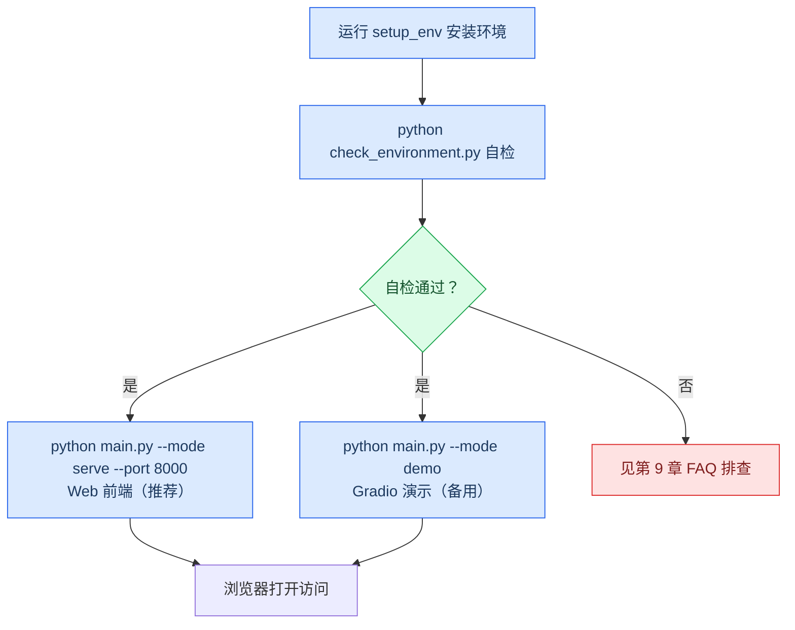

# 中草药多模态识别系统 用户手册

> 项目：herb_recognition（本草掠影）
> 版本：v1.0
> 日期：2026-09-02
> 适用范围：本手册面向系统部署与使用人员（验收老师、同学），覆盖「环境安装 → 环境检查 → 启动服务 → 各模块操作 → REST API → 常见问题」全流程。

---

## 1. 产品简介

本草掠影（中草药多模态识别系统）是一套打通 **图片识别 → 药性解析 → 知识图谱推理 → 方剂推荐 → AI 问答** 全链路的中草药科普辅助工具。系统基于「视觉 + 文本 + 知识图谱」多模态融合技术，识别结果附带药性详情、相似药材、配伍风险与经典方剂，并为每一条 AI 回答标注知识库来源，减少大模型幻觉。

系统定位为 **科普辅助工具**，不提供诊断与处方建议（详见第 10 章免责声明）。


---

## 2. 功能模块总览

系统提供 Web 前端（推荐）与 Gradio 演示端两个入口，二者功能对等：

| 模块 | Web 前端页签 | 主要能力 |
|------|------------|---------|
| 图片识别 | 图片识别 | 拖拽 / 点击 / Ctrl+V 粘贴上传图片，输出 Top-5 候选与「药材档案大卡」（置信度徽章、药性详情、相似药、易混鉴别、配伍风险、经典方剂） |
| 特性检索 | 特性检索 | 输入性味 / 归经 / 功效等文字，返回全部匹配药材的卡片网格，角标区分「完全匹配 / 部分匹配」 |
| 可解释性 | Grad-CAM | 上传图片生成模型关注区域热力图，滑块实时调节热力叠加透明度 |
| AI 问答 | AI 对话 | 聊天室式多轮对话，可附图提问，回答附「知识库来源」折叠卡片；无 API Key 时自动降级为本地检索 |
| 关系图谱 | 药材关系图谱 | 力导向网络图，可拖拽 / 缩放 / 点击；聚焦单药查看配伍与禁忌网络（红虚线=十八反、橙虚线=十九畏、绿实线=相须相使） |

所有结果区均附 **医疗风险提示**（毒性 / 禁忌药材强制警示）。

---

## 3. 运行环境要求

| 项目 | 最低要求 | 说明 |
|------|---------|------|
| 操作系统 | Windows 10/11、Linux、macOS | Windows 用 `setup_env.bat`，其余用 `setup_env.sh` |
| Python | 3.10+（推荐 3.10-3.11） | 由安装脚本自动创建虚拟环境 |
| GPU | NVIDIA 显卡（8G 显存） | CUDA 11.8 版 PyTorch；无 GPU 时以 CPU 运行（速度较慢） |
| 磁盘空间 | ≥ 60 GB | 数据约 38 GB + 模型权重约 1 GB + 虚拟环境 |
| 内存 | ≥ 16 GB | 共享内存 ≥ 12 GB |
| 浏览器 | Chrome / Edge 等现代浏览器 | 用于访问 Web 前端 |

> 首次启动 AI 对话会加载本地 BERT 模型（默认路径 `D:/models/bert-base-chinese`，约 20 秒，仅一次），用于知识库语义检索；路径不存在或加载失败时自动降级为关键词匹配，不影响对话功能。

---

## 4. 安装与检查

### 4.1 一键安装环境

在项目根目录执行：

```bat
:: Windows（CMD 或 PowerShell 双击运行）
setup_env.bat

:: Linux / macOS
bash setup_env.sh
```

脚本会依次完成：创建虚拟环境 `venv/` → 升级 pip → 安装 CUDA 11.8 版 PyTorch → 安装 `requirements.txt` 其余依赖。

### 4.2 激活虚拟环境

```powershell
:: Windows PowerShell
.\venv\Scripts\Activate.ps1

:: Windows CMD
venv\Scripts\activate.bat

:: Linux / macOS
source venv/bin/activate
```

### 4.3 环境自检

```bash
python check_environment.py
```

该脚本会检查 Python / PyTorch / 各依赖版本以及模型权重能否加载，输出 14 项检查结果；全部通过即可进入下一步。

---

## 5. 启动系统

系统提供两种入口，**推荐使用 Web 前端（`serve` 模式）**。



### 5.1 方式 A：Web 前端（推荐）

```bash
python main.py --mode serve --port 8000
```

- 浏览器打开 **http://127.0.0.1:8000**
- 前端为 `web/` 目录下的单页应用（`index.html` + `style.css` + `app.js`），由 FastAPI 直接托管，无外部依赖、无需构建
- 服务默认绑定 `0.0.0.0`，同一局域网设备可访问（见第 8 章）

### 5.2 方式 B：Gradio 演示（备用 / 调试）

```bash
python main.py --mode demo --ckpt experiments/checkpoints/best_model.pth
```

- 浏览器打开 **http://127.0.0.1:7862**
- 该入口适合演示预演与问题排查，界面与新前端统一为新中式主题

### 5.3 模型权重说明

- 未显式指定 `--ckpt` 时，系统默认加载 `experiments/checkpoints/best_model.pth`
- 若该文件不存在，会打印警告并使用随机初始化模型（此时识别结果无意义），请先完成训练或确认权重路径
- 官方评估权重为 `experiments/checkpoints/best_model.pth`（Epoch 5，约 510.9 MB），实测多模态 Top-1 准确率 0.9995、纯视觉 0.9548

---

## 6. Web 前端操作指南

### 6.1 图片识别

1. 切换到「图片识别」页签；
2. 上传图片：支持 **拖拽文件到区域**、**点击选择文件**、**Ctrl+V 粘贴截图** 三种方式；
3. 系统自动返回 Top-5 候选，默认选中最高置信度项；
4. 识别结果以「药材档案大卡」呈现，包含：
   - 置信度徽章（低置信度触发人工复核引导）
   - 药性详情（性味、归经、功效）
   - 相似药材推荐
   - 易混淆药材鉴别
   - 配伍风险（十八反 / 十九畏警示）
   - 经典方剂

### 6.2 特性检索

1. 切换到「特性检索」页签；
2. 输入药性特征，例如：`味甘平，归肝肾经` 或 `清热 解毒`；
3. 系统返回全部匹配药材的卡片网格，卡片右上角印章式角标标注「完全匹配 / 部分匹配」；
4. 点击卡片可查看该药材完整档案。

### 6.3 Grad-CAM 关注区域

1. 切换到「Grad-CAM」页签；
2. 上传图片；
3. 页面生成热力图叠加在原图上，展示模型识别所依据的图像区域；
4. 拖动「热力叠加透明度」滑块可实时调整热图强弱，便于人工核对模型是否依据药材主体部位判断。

### 6.4 AI 对话

1. 切换到「AI 对话」页签；
2. 在输入框提问，例如：`枸杞和菊花能一起用吗？`，支持多轮追问；
3. 可附加图片提问（图文混合）；
4. 回答末尾附「知识库来源」折叠卡片，展示本次回答引用的知识图谱条目（RAG 溯源）；
5. 首次提问需等待约 20 秒加载本地 BERT（仅一次）；
6. 未配置 API Key 或调用失败时，系统**自动降级为本地知识图谱检索结果**，不会报错中断。

### 6.5 药材关系图谱

1. 切换到「药材关系图谱」页签；
2. 页面展示药材关系网络（力导向图），支持拖拽布局、滚轮缩放、点击节点；
3. 上方筛选栏可按药性 / 科属 / 功效等条件过滤；
4. 聚焦单药后，页面突出显示其配伍网络与禁忌网络：
   - 红虚线 = 十八反（配伍禁忌）
   - 橙虚线 = 十九畏（配伍禁忌）
   - 绿实线 = 相须相使（常用配伍）

---

## 7. Gradio 备用界面操作

Gradio 入口（`http://127.0.0.1:7862`）包含与 Web 前端对应的 5 个页签：

- **图片识别**：上传图片 + 可选文本描述 → Top-3 识别 + 药性 / 相似药 / 方剂说明
- **特性检索**：输入性味 / 归经 / 功效 → 列出匹配药材 + 方剂推荐
- **模型关注区域（Grad-CAM）**：可视化模型识别依据的图像部位
- **AI 对话**：多轮对话，回答自动附带本地知识图谱 + RAG 检索依据；无 Key 自动降级
- **药材关系图谱**：交互式知识图谱可视化

> 两个入口后端逻辑相同，前端交互略有差异；日常演示以 Web 前端为主。

---

## 8. REST API 参考（serve 模式）

启动 `python main.py --mode serve --port 8000` 后，可通过 REST 接口调用核心能力，便于集成第三方系统。

| 接口 | 方法 | 说明 |
|------|------|------|
| `/` | GET | Web 前端单页应用（静态托管） |
| `/health` | GET | 健康检查，返回类别数与 LLM 可用状态 |
| `/predict` | POST | 图片 + 文本识别（multipart；`image` 留空则做纯文本特性检索），返回 Top-5 + 药性 / 相似药 / 方剂 |
| `/search` | POST | 纯文本特性检索（JSON：`{"text":"味甘平，归肝肾经"}`），返回结构化 `parsed / full / partial` |
| `/explain` | POST | Grad-CAM 热图（multipart，返回 PNG，说明在 `X-Explain-Info` 响应头） |
| `/chat` | POST | 外部 LLM 对话解释（multipart；`question` + 可选 `image` + 可选 `history` 多轮），返回 `answer` + `rag_sources` |
| `/graph` | GET | 药材关系图谱 JSON（可选 `?focus=枸杞`；含 `nodes / links / categoryColors`） |
| `/herbs` | GET | 全部药材名列表（前端输入自动补全用） |

调用示例（Windows PowerShell）：

```bash
:: 图片识别：本地图片 + 可选文字
curl.exe -F "image=@photo.jpg;type=image/jpeg" -F "text=味甘" http://127.0.0.1:8000/predict

:: 特性检索
curl.exe -X POST -H "Content-Type: application/json" -d "{\"text\":\"味甘平，归肝肾经\"}" http://127.0.0.1:8000/search

:: AI 对话（图片 + 问题）
curl.exe -F "image=@gouqi.jpg;type=image/jpeg" -F "question=这是什么药材？有什么功效？" http://127.0.0.1:8000/chat

:: AI 对话（多轮追问，history 为 JSON 字符串）
curl.exe -F "question=枸杞和菊花能一起用吗？" -F "history=[{\"role\":\"user\",\"content\":\"介绍一下枸杞\"},{\"role\":\"assistant\",\"content\":\"枸杞：滋补肝肾、益精明目……\"}]" http://127.0.0.1:8000/chat
```

### 8.1 外部 LLM 配置（可选，仅 /chat 需要）

AI 对话调用智谱 GLM（OpenAI 兼容）。API Key 为敏感信息，请以环境变量方式配置，**勿写入代码或配置文件**：

```powershell
$env:ZHIPU_API_KEY="你的key"
# 可选覆盖（默认 https://open.bigmodel.cn/api/paas/v4，模型 glm-4-flash）
$env:LLM_BASE_URL="https://open.bigmodel.cn/api/paas/v4"
$env:LLM_MODEL="glm-4-air"
```

- 未配置 Key 或调用失败时**不会报 500**：`/chat` 自动降级返回本地知识图谱结果，`llm` 字段标记为 `disabled` / `error`；
- 返回体含 `rag_sources`（本次引用的知识库条目）；
- 默认模型为免费档 `glm-4-flash`，遇 429 限流 / 5xx 自动退避重试 3 次。

---

## 9. 局域网访问

服务默认绑定 `0.0.0.0`，同一局域网内的手机 / 电脑可直接访问：

```powershell
# 1. （可选）确认 AI 对话所需 API Key 已配置
echo $env:ZHIPU_API_KEY

# 2. 防火墙放行端口（首次需管理员权限终端，端口以实际启动端口为准）
netsh advfirewall firewall add rule name="HerbRecognition" dir=in action=allow protocol=TCP localport=8000

# 3. 启动服务
python main.py --mode serve --port 8000

# 4. 查看本机局域网 IP（IPv4 地址，如 192.168.1.100）
ipconfig
```

其他设备浏览器打开 `http://192.168.1.100:8000` 即可访问。

> - 端口可用环境变量 `GRADIO_SERVER_PORT` 覆盖（换端口后需同步修改防火墙规则）；
> - API Key 只需配置在运行服务的那台电脑上，访问网页的设备不需要任何配置；
> - 运行服务的电脑需保持开机、不睡眠；
> - 如需从公网（异地）访问，可另用内网穿透（cpolar / ngrok）或部署到云服务器。

---

## 10. 常见问题（FAQ）

| # | 问题 | 原因 / 解决方法 |
|---|------|----------------|
| 1 | 启动时提示「未找到权重，使用随机初始化模型」 | 默认权重 `experiments/checkpoints/best_model.pth` 不存在。请完成训练，或启动时用 `--ckpt` 显式指定已有权重路径 |
| 2 | 训练出现显存不足（OOM） | 将 `experiments/configs/default_config.yaml` 中 `batch_size` 降至 8，或 `image_size` 降至 192 后重试 |
| 3 | 局域网其他设备无法访问 | 检查服务是否已启动（`0.0.0.0` 绑定）；确认防火墙已放行对应端口；确认两端在同一网段 |
| 4 | AI 对话返回的是本地知识结果而非大模型回答 | 未配置 `ZHIPU_API_KEY` 或调用失败，系统已自动降级为本地检索（`llm` 字段为 `disabled` / `error`）。如需大模型回答，配置环境变量后重启服务 |
| 5 | AI 对话首次提问等待约 20 秒 | 首次会加载本地 BERT 模型（`D:/models/bert-base-chinese`）用于语义检索，仅一次；之后无需等待。若该路径不存在会自动降级为关键词匹配 |
| 6 | 如何确认系统运行正常 | 浏览器访问 `http://127.0.0.1:8000/health`，返回类别数与 LLM 可用状态 |
| 7 | 需要换端口启动 | `serve` 模式用 `--port`；Gradio 模式用环境变量 `GRADIO_SERVER_PORT` |
| 8 | 纯视觉识别与多模态识别有何区别 | 模型同时支持「图片+文本」多模态与「纯视觉」双分支。官方评估：多模态 Top-1 0.9995，纯视觉 0.9548，文本辅助增益 Δacc +0.0447 |

---

## 11. 安全与免责声明

- 本系统定位为 **科普辅助工具**，输出内容仅供参考，**不提供诊断、处方或治疗建议**；
- 所有识别输出附置信度提示，低置信度会触发人工复核引导；
- 毒性 / 禁忌药材（如十八反、十九畏配伍）强制风险警示，严禁据此自行用药；
- 知识输出附来源标注（溯源），供使用者核验；
- 如需用药，请务必咨询执业医师或药师。

---

## 附录：常用命令速查

| 目的 | 命令 |
|------|------|
| 安装环境（Windows） | `setup_env.bat` |
| 安装环境（Linux/macOS） | `bash setup_env.sh` |
| 环境自检 | `python check_environment.py` |
| 启动 Web 前端 | `python main.py --mode serve --port 8000` |
| 启动 Gradio 演示 | `python main.py --mode demo` |
| 训练 | `python main.py --mode train --config experiments/configs/default_config.yaml` |
| 评估 | `python main.py --mode eval` |
| 小样本训练 + 评估 | `python main.py --mode few-shot` |
| 小样本仅评估 | `python main.py --mode few-shot --fs-eval-only` |
| 健康检查 | 浏览器访问 `http://127.0.0.1:8000/health` |
