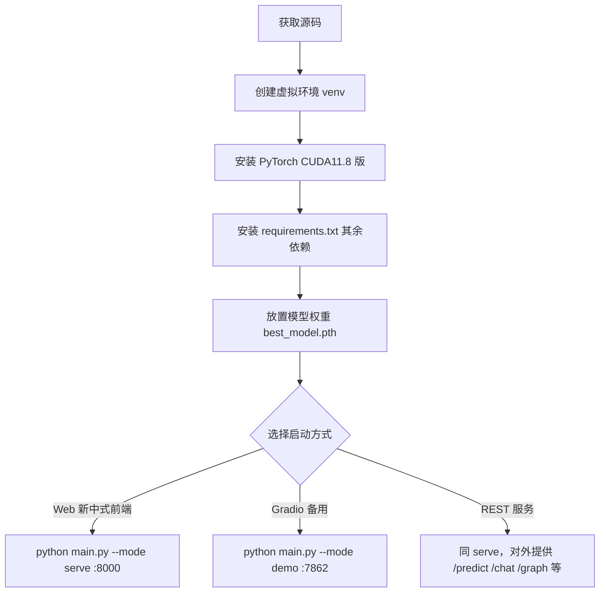

# 部署与第三方组件说明

> 对应认证式交付物目录 `02_系统实现和测试 / 源代码（部署文件 + 第三方组件）`。
> 本文档说明系统如何安装、部署、运行，以及所依赖的全部第三方组件、预训练权重与外部数据源，便于复现与验收。

---

## 1. 系统部署总览



系统为纯 Python 服务，**无需前端构建**，FastAPI 直接托管 `web/` 下的静态 HTML/CSS/JS。硬件门槛为 **8G 显存**；显存不足时通过降 `batch_size=8` 或 `image_size=192` 回退运行。

---

## 2. 环境要求

| 类别 | 要求 |
|---|---|
| 操作系统 | Windows 10/11（推荐）、Linux、macOS |
| Python | 3.10 ~ 3.12（已验证 3.12 虚拟环境可用） |
| GPU | NVIDIA，CUDA 11.8，显存 ≥ 8G（无 GPU 可回退 CPU，速度显著下降） |
| 磁盘 | 模型权重约 511 MB + 外部图像数据集约 266K 张（可选，演示可不下载全量） |
| 外部 LLM | 可选：智谱 GLM 兼容接口（设置 `ZHIPU_API_KEY` 环境变量） |

---

## 3. 安装与部署步骤

### 3.1 Windows 一键安装

```bat
setup_env.bat
```

脚本动作：`python -m venv venv` → 激活 → 升级 pip → 安装 CUDA 11.8 版 `torch/torchvision` → `pip install -r requirements.txt`。

### 3.2 Linux / macOS 一键安装

```bash
bash setup_env.sh
```

### 3.3 环境自检

```bash
python check_environment.py
# 等效于：python main.py --mode check
```

自检会校验 Python 版本、关键依赖、模型权重路径、BERT 本地路径是否存在。

### 3.4 放置模型权重

默认权重路径 `experiments/checkpoints/best_model.pth`（约 510.93 MB）。若使用其他位置，用环境变量 `CKPT` 或命令行 `--ckpt` 指定：

```bash
set CKPT=experiments/checkpoints/best_model.pth   # Windows
# 或
python main.py --mode serve --ckpt experiments/checkpoints/best_model.pth
```

### 3.5 启动服务

| 模式 | 命令 | 访问地址 | 说明 |
|---|---|---|---|
| Web 前端（推荐） | `python main.py --mode serve --port 8000` | http://127.0.0.1:8000 | 新中式前端，五大模块 |
| Gradio 备用 | `python main.py --mode demo --ckpt experiments/checkpoints/best_model.pth` | http://127.0.0.1:7862 | 兼容演示入口 |
| 仅训练 | `python main.py --mode train --config experiments/configs/default_config.yaml` | — | 必须 `pretrained: true` |
| 仅评估 | `python main.py --mode eval` | — | 报告见 `evaluation/reports/` |
| 小样本 | `python main.py --mode few-shot` | — | 原型网络，可 `--fs-eval-only` |

### 3.6 局域网 / 多机访问

- 服务绑定 `0.0.0.0`；Windows 防火墙放行端口 `8000` / `7862`。
- 通过 `ipconfig` 查询本机 IP，他人访问 `http://<你的IP>:8000`。

---

## 4. Docker 部署（可选，附 Dockerfile）

项目提供 `Dockerfile`，可构建镜像一键部署（需宿主机已装 NVIDIA 驱动并配置 `nvidia-container-toolkit`）：

```bash
docker build -t herb-recognition:latest .
docker run --gpus all -p 8000:8000 \
  -e CKPT=experiments/checkpoints/best_model.pth \
  -v "%cd%/experiments/checkpoints:/app/experiments/checkpoints" \
  herb-recognition:latest
```

> 注意：Docker 镜像默认不含 `best_model.pth`，需通过 `-v` 挂载宿主机权重目录；BERT 本地路径 `D:/models/bert-base-chinese` 在容器内不可用，应改为挂载或设置 `BERT_MODEL_PATH` 指向容器内路径（默认回退为关键词检索，不影响核心识别）。

---

## 5. 第三方组件清单

### 5.1 Python 依赖（来自 `requirements.txt`）

| 组件 | 最低版本 | 用途 |
|---|---|---|
| torch | 2.0.0 | 深度学习框架（CUDA 11.8 版） |
| torchvision | 0.15.0 | 视觉模型与数据变换 |
| timm | 0.9.0 | 视觉骨干网络（Swin/ConvNeXt 等） |
| open-clip-torch | 2.20.0 | 多模态对比学习编码器 |
| transformers | 4.35.0 | 文本编码器（BERT-base-chinese） |
| sentencepiece | 0.1.99 | BERT 分词依赖 |
| networkx | 3.1 | 知识图谱内存版图计算 |
| albumentations | 1.3.0 | 数据增强 |
| Pillow | 9.5.0 | 图像读写 |
| loguru | 0.7.0 | 日志 |
| pyyaml | 6.0 | 配置解析 |
| tqdm | 4.65.0 | 训练进度条 |
| matplotlib | 3.7.0 | 可视化 / Grad-CAM |
| scikit-learn | 1.3.0 | 评估指标 |
| gradio | 4.5.0 | 交互式演示界面 |
| fastapi | 0.110.0 | REST API 服务 |
| uvicorn | 0.29.0 | ASGI 服务器 |
| python-multipart | 0.0.9 | 文件上传解析 |

> 外部 LLM 调用复用 FastAPI 自带的 `httpx`，**无需额外依赖**。
> 真实图数据库 `neo4j` / `py2neo` 仅在 `use_neo4j: true` 时需要，当前默认 `false`（内存版 NetworkX），故未列入必装。

### 5.2 预训练权重与外部模型

| 名称 | 来源 / 路径 | 说明 |
|---|---|---|
| 视觉-文本联合模型权重 `best_model.pth` | `experiments/checkpoints/best_model.pth`（约 511 MB） | 项目训练产出，官方评测 acc 无文本 0.9995 / 有文本 0.9548 |
| 小样本原型权重 `few_shot_proto.pth` | `experiments/checkpoints/few_shot_proto.pth` | 少样本模式产出 |
| 视觉骨干（Swin / ConvNeXt 等） | 经 `timm` 从 PyTorch Hub 下载，配置 `pretrained: true` | 训练时自动拉取 |
| 文本编码器 `bert-base-chinese` | 本地 `D:/models/bert-base-chinese`（默认）；可设 `BERT_MODEL_PATH` 覆盖 | 首次 `/chat` 加载约 20 秒；缺失时降级关键词检索 |
| CLIP 权重 | 经 `open-clip-torch` 下载 | 多模态对齐 |

### 5.3 外部数据源

| 数据 | 来源 | 用途 |
|---|---|---|
| 外部图像数据集 `cls_chinese_medicine` | `data/external/`（约 266K 张，163 类） | 训练 / 评测集原始来源 |
| 知识图谱 CSV | `knowledge_graph/*.csv`（项目构建，含十八反/十九畏规则内置） | 关系图谱与特性检索 |
| 方剂数据 | `knowledge_graph/formulas.csv`（13 方） | AI 对话知识库 |

### 5.4 可选外部服务

| 服务 | 配置方式 | 说明 |
|---|---|---|
| 智谱 GLM（或任意 OpenAI 兼容接口） | 环境变量 `ZHIPU_API_KEY`；可选 `LLM_BASE_URL` / `LLM_MODEL`（默认 `glm-4-flash`） | **仅用于 AI 对话模块**；Key 敏感，勿写入代码；缺失或调用失败自动降级本地检索，不报 500 |

---

## 6. 端口与接口速查

| 端口 | 服务 | 主要接口 |
|---|---|---|
| 8000 | Web 前端 / REST | `/predict`、`/search`、`/explain`、`/chat`、`/graph`、`/herbs`、`/health` |
| 7862 | Gradio 演示 | 内置界面 |

详见 `docs/交付文档/用户手册.md` 的 REST API 章节。

---

## 7. 常见问题

| 现象 | 原因 / 解决 |
|---|---|
| 启动报找不到 `best_model.pth` | 权重未放置；用 `CKPT` 或 `--ckpt` 指定正确路径 |
| `/chat` 首次很慢 | 正在加载本地 BERT（约 20 秒），属正常；失败则降级关键词检索 |
| 显存不足 OOM | 降低 `batch_size=8` 或 `image_size=192` |
| 局域网无法访问 | 防火墙未放行端口；服务需绑定 `0.0.0.0` |
| AI 对话无响应 / 报错 | 未配置 `ZHIPU_API_KEY` 或网络不通，系统已自动降级本地检索，非故障 |

---

## 8. 免责声明

本系统为**中医药科普辅助工具**，识别与推荐结果**不构成医疗建议**，不替代专业医师诊断与用药。临床用药请遵医嘱。
