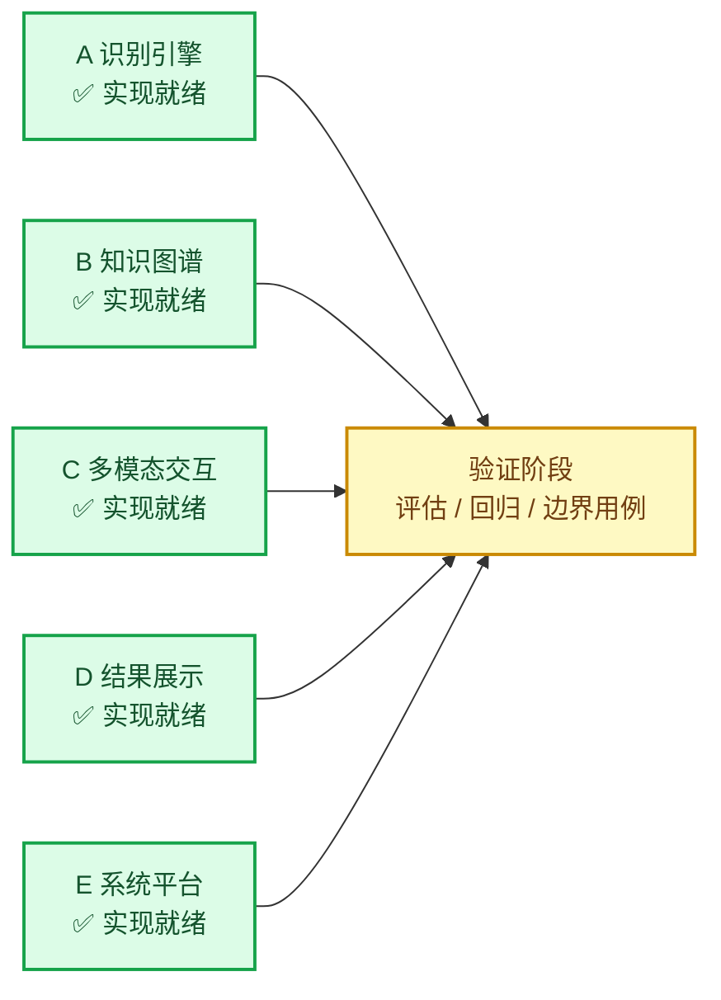
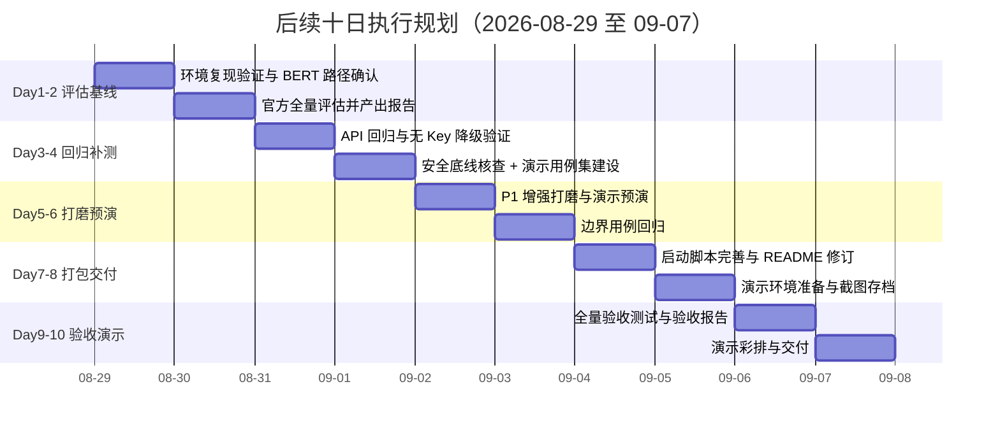

# herb_recognition 项目进度对比与后续规划

> 项目：herb_recognition（中草药多模态识别系统）
> 版本：v1.0
> 日期：2026-08-28
> 规划周期：2026-08-29 至 2026-09-07（10 天）
> 依据：`docs/plan.md`（项目开发计划）、`docs/research_report.md`（调研报告）+ 2026-08-28 代码库实证盘点
> 性质：**仅规划、不执行**（本文档不触发任何代码 / 数据 / 权重变更，执行待另行确认）

---

## 摘要（结论先行）

**核心结论：项目开发完成度高——五大模块（A-E）代码、数据资产（256,767 张训练图 / 10,000 张验证图 / 163 类）、模型权重、REST API（5 接口）、Gradio 演示端（5 页签）均已就绪，相当于原计划 10 人天中约 9 人天的实现工作已提前完成。剩余工作集中在"验证—补缺—打包—交付"四类：①官方全量评估已产出（`evaluation/reports/eval_official.log` 原始逐类报告 + `eval_official_report.md` 精炼报告，实测 0.9995 / 0.9548 / Δacc +0.0447，与 README 完全一致）；②演示用例集未建设（易混淆 / 模糊 / 毒药材样本）；③验收（D9）与演示交付（D10）未执行。后续按 10 天周期、约 7.5 人天规划执行，检查点沿用"Day2 末 / Day5 末"，落后即砍 P1 增强而非挤压验收时间。**

| 结论 | 依据（实证） |
|------|------|
| 开发完成度高 | 五大模块代码齐全、无 lint 错误；git 已提交"初始化 + 文档"两次 |
| 数据就绪 | `train.txt` 256,767 行 / `val.txt` 10,000 行 / `label2idx.json` 163 类，与配置一致 |
| 权重就绪 | `experiments/checkpoints/best_model.pth`（默认路径匹配）、`checkpoints_v2/best_model.pth` |
| 功能就绪 | REST API 5 接口（含无 Key 降级 + RAG 溯源）、Gradio 5 页签、知识图谱 202 节点 |
| 三大差距 | ①评估报告缺失 ②演示用例集缺失 ③验收 / 演示交付未执行 |
| 本期任务 | 验证—补缺—打包—交付，约 7.5 人天，10 天周期 |

---

## 1. 当前进度盘点

### 1.1 五大模块进度总览

| 模块 | 功能范围（计划） | 实际实现（实证） | 状态 |
|------|----------------|-----------------|:----:|
| **A 识别引擎** | 图片识别候选排序、图文混合识别、置信度提示、相似药材提示 | `models/classifier.py`（HerbClassifier 多模态 + 纯视觉双分支自动切换）、`vision_encoder.py`（Swin/ResNet/ConvNeXt/EfficientNet）、`text_encoder.py`（BERT）、`fusion_module.py`（HCA-Fusion 交叉注意力）；Gradio 输出 Top-3/Top-5 置信度，无输入引导 | ✅ 就绪 |
| **B 知识图谱** | 药材属性库 + 实体关系网络、方剂推荐与配伍风险、特性检索、图谱可视化 | `kg_builder.py`（554 行）构建/查询/配伍/禁忌/相似药/方剂推荐/特性检索/可视化导出一体；`herbs.csv` 202 药材节点，内置十八反 16 对 / 十九畏 9 对；`recommend_formula()` 动态方剂推荐 | ✅ 就绪 |
| **C 多模态交互** | 图转文本、文本提问、多轮问答、RAG 图文混合提问 | `app/api.py` `/chat` 支持 history 多轮（≤10 轮）、`rag_retriever.py` 本地 BERT 语义检索 + 关键词降级、`predict_json()` 支持纯文本特性检索 | ✅ 就绪（无独立"图转文本描述生成"，图文融合用于分类） |
| **D 结果展示** | 识别详情 / 药性分析 / 方剂联动、医疗风险提示、关注区域可视化、溯源展示 | Gradio 页签含识别详情 + 药性解析 + 【相似药/方剂推荐】、模型关注区域（Grad-CAM）、RAG 溯源（`rag_sources`）；毒性/禁忌风险提示实现 | ✅ 就绪 |
| **E 系统平台** | Web 演示端（多页签）、REST 核心接口、无 Key 本地降级、一键部署 | `app/gradio_app.py` 5 页签（图片识别 / 特性检索 / 关注区域 / AI 对话 / 药材关系图谱）；`api.py` 5 接口（/health、/predict、/search、/explain、/chat）；`_local_answer()` 无 Key 降级不报 500 | ✅ 就绪 |

### 1.2 数据 / 权重 / 环境资产

| 资产 | 实际规模 / 内容（实证） | 状态 |
|------|------------------------|:----:|
| 训练数据 | `data/external/cls_chinese_medicine/train.txt` 256,767 行；`data/processed/train.csv`（38.66MB），列 `image_path,label,text` | ✅ 就绪 |
| 验证数据 | `val.txt` 10,000 行；`val.csv`、`val_no_text.csv`（纯视觉评测集，text 列为空） | ✅ 就绪 |
| 类别规模 | `label2idx.json` 索引 0-162，共 163 类（含异形饮片如人参/人参切片等），与 config `num_classes:163` 一致 | ✅ 就绪 |
| 子集数据 | `quick_train.csv`（16 类 ≈4,800 张）、`quick_val.csv`（≈791 张）、`train_sub.csv`、`val_sub.csv`（子采样） | ✅ 就绪 |
| 模型权重 | `experiments/checkpoints/best_model.pth`（510.93MB，main.py 默认 `--ckpt` 路径匹配）、`checkpoints_v2/best_model.pth`；`best_model_v1_20260823.pth` 为冗余副本 | ✅ 就绪 |
| 知识图谱数据 | `knowledge_graph/herbs.csv`（202 行数据）、`herb_properties.csv`、`herbs_sample.csv`；`tools/build_herb_kb.py` 生成 163 类 + 39 额外节点 | ✅ 就绪 |
| 环境脚本 | `setup_env.bat/.sh`（venv + CUDA 11.8 torch + requirements）、`check_environment.py`（14 项依赖 + 权重加载自检）、`check_vision.py` / `check_vision_pro.py`（视觉链路抽检） | ✅ 就绪 |
| 配置文件 | `experiments/configs/default_config.yaml`：swin_tiny + bert-base-chinese + HCA fusion，epochs 8、lr 1e-4，few_shot 原型网络，`use_neo4j:false` | ✅ 就绪 |
| 依赖清单 | `requirements.txt`：torch / timm / transformers / networkx / gradio / fastapi 等 | ✅ 就绪 |

### 1.3 评估与演示现状（差距集中区）

| 项目 | 实证 | 状态 |
|------|------|:----:|
| 评估脚本 | `evaluation/evaluator.py`（75 行）：`evaluate()`、`top_k_accuracy()`、`predict_topk()`；由 `main.py --mode eval` 触发，支持 `--ckpt` / `--no-text` | ✅ 就绪 |
| 评估报告产物 | `evaluation/reports/eval_official.log`（原始逐类报告）+ `eval_official_report.md`（精炼报告）已产出 | ✅ 就绪 |
| README 一致性 | README 评估数据（0.9995 / 0.9548 / Δacc +0.0447）已由日志佐证；引用改为精炼报告 `eval_official_report.md` | ✅ 一致 |
| 演示用例集 | 全项目无易混淆 / 模糊 / 毒药材样本清单或 demo 脚本（`tools/` 下仅 `build_herb_kb.py`、`export_model.py`、`subsample_dataset.py`） | ❌ 缺失 |
| git 状态 | 仅 2 次提交：`74f67ca`（项目初始化）、`4dd584c`（add docs，最新）；数据集/权重/日志均被 `.gitignore` 忽略不入库 | — |

---

## 2. 与计划的差距分析

### 2.1 按天任务映射（对照 `docs/plan.md` 3.1 节）

| 天 | 计划任务 | 实际状态 | 说明 |
|:--:|---------|:--------:|------|
| D1-D2 | 环境搭建 + 数据准备 | ✅ 基本完成 | 环境脚本 / 依赖 / 数据 / 权重就绪；本地 BERT 路径（`D:/models/bert-base-chinese`，项目外）**待验证** |
| D3-D4 | 识别链路 + 置信度引导 + 图谱联动 + 风险提示 | ✅ 完成 | 代码全量实现（A、B、D 模块） |
| D5-D6 | 相似药材提示 + RAG 溯源展示 | ✅ 完成 | 代码实现（`similar_by_function()`、`rag_sources`），待演示预演 |
| D7-D8 | 启动脚本 + README + 演示数据集 | ⚠️ 部分完成 | 脚本 / README 就绪；**演示数据集未建设** |
| D9 | 全量验收测试（含边界用例） | ❌ 未执行 | 评估报告 / 边界用例 / 验收报告均缺失 |
| D10 | 演示交付 | ❌ 未执行 | 演示脚本 / 答辩材料未产出 |

### 2.2 验收标准达成情况（对照 `docs/plan.md` 5 节）

| # | 验收项 | 标准 | 当前状态 | 差距 |
|---|--------|------|:--------:|------|
| 1 | 环境可复现 | 新设备按文档 ≤30 分钟跑通全链路 | ⚠️ 待验证 | 未在新设备实测；BERT 本地路径未确认 |
| 2 | 识别能力 | 准确率达到可用门槛（以官方评估实测为准）；演示用例全部正确 | ⚠️ 待验证 | 官方全量评估未出报告，无实测数据；演示用例未建设 |
| 3 | 安全底线 | 风险提示覆盖 100% 输出；毒性 / 禁忌药材强制警示 | ⚠️ 待核查 | 代码已实现，未做全覆盖核查 |
| 4 | 功能完整 | 五大模块核心闭环可用，无致命崩溃 | ⚠️ 待回归 | 代码完整、无 lint 错误，未做全量回归 |
| 5 | 降级可用 | 未配置 API Key 时本地检索降级正常，不报 500 | ⚠️ 待实测 | `_local_answer()` 已实现，未实测验证 |

### 2.3 交付物清单达成情况（对照 `docs/plan.md` 5 节）

| 序号 | 交付物 | 验收时间点 | 当前状态 |
|:----:|--------|:----------:|:--------:|
| 1 | 环境检查报告 | D2 | ❌ 未产出（`check_environment.py` 可运行，但未存档报告） |
| 2 | 核心闭环可演示版本 | D4 | ✅ 就绪 |
| 3 | 差异化功能演示（相似提示 + 溯源展示） | D6 | ✅ 实现就绪，待演示预演 |
| 4 | 一键启动脚本 + README + 演示数据集 | D8 | ⚠️ 脚本 / README 就绪，演示数据集缺失 |
| 5 | 验收报告（问题清零） | D9 | ❌ 未产出 |
| 6 | 演示脚本 + 答辩材料 | D10 | ❌ 未产出 |

### 2.4 未完成 / 未验证项清单（按优先级）

| # | 事项 | 类型 | 优先级 | 影响 / 对应验收项 |
|---|------|------|:------:|------------------|
| 1 | 官方全量评估报告 + `eval_official.log` | 已完成 | P0 | 实测 0.9995/0.9548 与 README 一致；精炼报告 + 日志已留档 |
| 2 | 演示用例集（易混淆 / 模糊 / 毒药材） | 未完成 | P0 | 验收项 2、演示翻车风险（计划文档 4.3） |
| 3 | 环境复现实测（新设备 ≤30 分钟）+ BERT 路径确认 | 未验证 | P0 | 验收项 1 |
| 4 | API 回归 + 无 Key 降级实测 | 未验证 | P0 | 验收项 4 / 5 |
| 5 | 安全底线全覆盖核查（含毒药强提醒） | 未验证 | P0 | 验收项 3 |
| 6 | 全量功能回归（边界用例：模糊 / 低光 / 相似 / 防崩溃） | 未验证 | P0 | 验收项 4 |
| 7 | README 修订（评估结果附 log 佐证、冗余权重说明） | 待办 | P1 | 文档一致性 |
| 8 | Neo4j 模式（`kg_builder.py` 抛 `NotImplementedError`） | 已知限制 | 说明 | 默认 `use_neo4j:false`，内存 NetworkX 可用，不影响演示 |

---

## 3. 接下来 10 天执行规划

### 3.1 里程碑甘特图

### 3.2 按天任务表

| 天 | 阶段 | 任务 | 验收标准 | 人天 |
|:--:|------|------|---------|:---:|
| D1 | 评估基线 | 环境复现验证：新建 venv 跑 `setup_env`、`check_environment.py` 全通过；确认本地 BERT 路径（不存在则规划降级方案） | 环境检查报告产出（交付物 1） | 0.5 |
| D2 | 评估基线 | 官方全量评估：`main.py --mode eval` 输出报告至 `evaluation/reports/` 并生成 `eval_official.log`，README 引用对齐 | 评估报告 + log 产出（交付物 2 佐证） | 1.0 |
| D3 | 回归补测 | API 回归：`/health /predict /search /explain /chat` 5 接口 + 无 Key 降级 + RAG 溯源实测 | 无 Key 不报 500（验收项 5） | 0.5 |
| D4 | 回归补测 | 安全底线核查：风险提示 100% 覆盖核查（含毒性药材强制提醒）；启动演示用例集建设 | 安全底线核查通过（验收项 3） | 0.5 |
| D4-D5 | 回归补测 | 演示用例集建设：从 val 集筛选易混淆 / 模糊 / 毒药材样本，建立预置目录与清单 | 演示用例集交付（交付物 4 补齐） | 1.0 |
| D5-D6 | 打磨预演 | P1 增强打磨：相似药材提示、溯源展示演示预演与话术优化 | 差异化功能演示通过（交付物 3） | 0.5 |
| D6 | 打磨预演 | 边界用例回归：模糊 / 低光 / 相似药材 / 防崩溃 / 无 Key 全场景 | 无致命崩溃（验收项 4） | 0.5 |
| D7 | 打包交付 | 启动脚本完善 + README 修订（评估结果附 log 佐证、冗余权重 `best_model_v1_20260823.pth` 清理说明、Neo4j 限制说明） | 新设备按文档 ≤30 分钟跑通（验收项 1） | 0.5 |
| D8 | 打包交付 | 演示环境准备：离线可跑、预置用例就位、全链路截图存档 | 演示环境就绪 | 0.5 |
| D9 | 验收测试 | 全量回归 + 边界用例复核，产出验收报告（问题清零） | 验收报告（交付物 5，验收项 2-5 复核） | 1.0 |
| D10 | 演示交付 | 演示彩排 + 答辩材料整理 | 正式演示交付（交付物 6） | 1.0 |
| | | **合计** | | **7.5** |

### 3.3 检查点与缓冲策略

- **检查点 A（Day2 末）**：环境复现通过 + 官方评估报告产出。若未达标，优先补齐评估基线（它是验收项 2 的唯一实证），可顺延演示用例集建设。
- **检查点 B（Day5 末）**：演示用例集建成 + 无致命问题。若落后，**立即砍 P1 打磨（D5-D6 的 3.1）**，将时间让给 D9 验收，而非挤压验收时间（沿用计划文档 3.1 节缓冲管理策略）。
- **口径说明**：原计划 10 人天中约 9 人天的开发实现已提前完成（D1-D6 对应工作全部落地）；本期剩余 7.5 人天 = 计划内未完成的打包/验收（约 1 人天）+ 计划中未细化的验证补缺工作（评估报告、演示用例集、边界回归等，约 6.5 人天）。剩余 2.5 人天作为缓冲，与计划文档"10 天无天然缓冲"相比，当前进度为验收留出了余地。

### 3.4 风险与应对（本期新增）

| 风险 | 等级 | 触发点 | 应对 |
|------|:----:|--------|------|
| 本地 BERT 路径缺失 | 中 | `D:/models/bert-base-chinese` 不存在 | D1 提前确认；降级方案：下载 `bert-base-chinese` 至项目内路径，或切换 open-clip 中文权重并回归 |
| 评估结果不达门槛 | 中 | 官方全量准确率低于可用门槛 | 优先以纯视觉模式（`--no-text`）+ 高置信度用例演示；预留微调时间（原计划 4.1-3 预案） |
| 演示用例集质量不足 | 中 | 预置图片识别失败率高 | 从 val 集按置信度筛选 + 人工标注易混淆 / 毒药材用例；低置信度用例配失败引导话术 |
| 冗余权重混淆 | 低 | `best_model_v1_20260823.pth` 与 `best_model.pth` 并存 | 明确默认路径（`main.py --ckpt` 默认值），README 说明清理 |
| 文档文件名不一致 | 低 | 文档互引使用中文名（`docs/项目开发计划.md`）而实际文件为英文名（`docs/plan.md`） | 本文档已按实际文件名引用；后续可统一修订既有文档引用 |

---

## 4. 附录

### 4.1 证据清单（2026-08-28 代码库实证）

| 证据 | 位置 / 内容 |
|------|------------|
| 数据规模 | `data/external/cls_chinese_medicine/train.txt`（256,767 行）、`val.txt`（10,000 行）、`label.txt`（163 类） |
| 类别映射 | `data/processed/label2idx.json`（0-162，163 类） |
| CSV 结构 | `data/processed/*.csv` 列：`image_path,label,text`；`val_no_text.csv` 为纯视觉评测集 |
| 权重 | `experiments/checkpoints/best_model.pth`、`experiments/checkpoints_v2/best_model.pth`（510.93MB 各）；`best_model_v1_20260823.pth`（冗余） |
| 评估 | `evaluation/evaluator.py`（75 行）；`main.py` `--mode eval`；`evaluation/reports/` 为空；全项目无 `*.log` |
| 图谱 | `knowledge_graph/kg_builder.py`（554 行）；`herbs.csv`（202 行）；`tools/build_herb_kb.py`（生成脚本） |
| 应用层 | `app/api.py`（242 行，5 接口）；`app/gradio_app.py`（5 页签）；`app/rag_retriever.py`；`main.py`（248 行，7 种模式） |
| 配置 | `experiments/configs/default_config.yaml`（79 行，num_classes=163 等） |
| git | 提交 `74f67ca`（初始化）、`4dd584c`（add docs，最新） |

### 4.2 执行边界声明

- 本文档为**规划性质**，撰写过程未触发任何代码、数据、权重或配置变更；
- 进度盘点以 2026-08-28 代码库实证为准（文件存在性、CSV 行数、git 历史、代码实现），不包含对未发生工作的推断；
- 后续执行（评估 / 回归 / 打包 / 演示）需用户另行确认后启动，并按本文档 3.2 节排期推进；
- 工作量与优先级口径与 `docs/plan.md`、`docs/research_report.md` 保持一致（10 人天总量、P0/P1/P2 定义、5 项验收标准、6 项交付物）。
